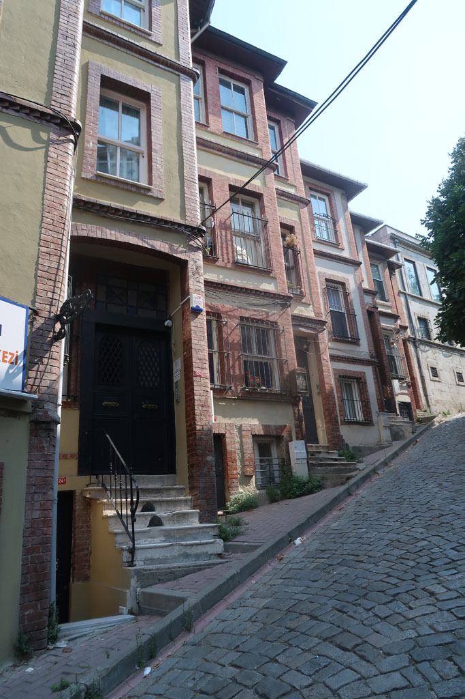
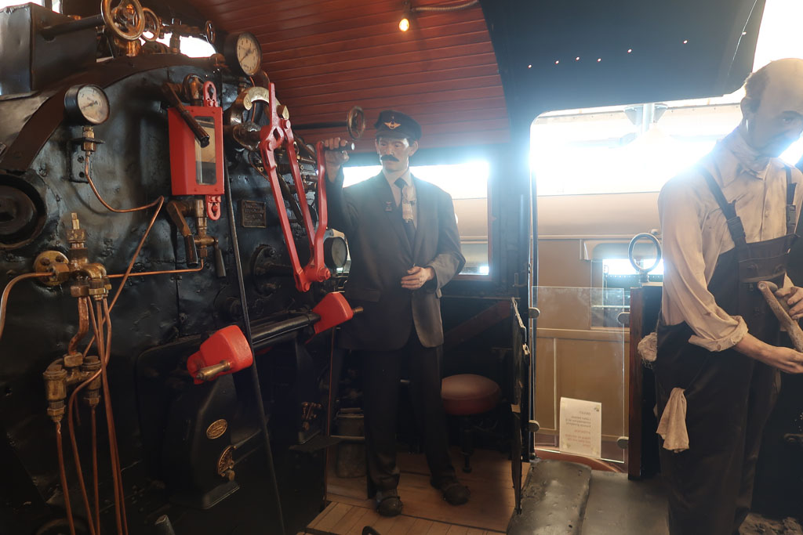
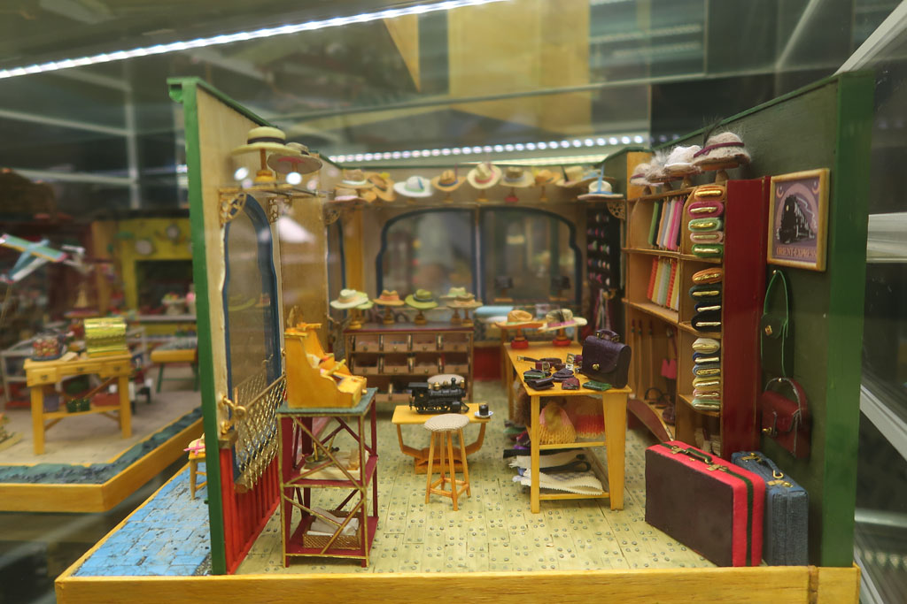

Toujours pas de notes pour cette journée à **Istanbul**, de mémoire voici le programme.

Réveil

Partons à pieds de l’hôtel visiter la suite des environs. Nous sommes clairement dans une zone résidentielle sans trop de commerces et aucuns touristes. Nosu profitons de la vie locale.  
Balade dans le parc *Çarşamba Çukurbostan Parkı*.

Pause çais chez *şehzade1979* avant de redescendre la **colline** vers la **mosquée** de *Fethiye*.

Nous allons ensuite vers *Saint-Sauveur-in-Chora* mais cette dernière est fermée.

Parcourons les ruelles colorées et instagrammables (certaines sont d'ailleurs bondées de touristes, mais pas leurs parallèles).

Prenons le ferry à **Haliç Parkı** pour **Hasköy**. comme il est environ midi arret dans une lokantasi (*ÇINAR Kebap*) derrière la mosquée *Hacı Şaban*

Nous passons ensuite l’après midi à visiter le musée *Rahmi M. Koç* tout aussi délirant que celui visité l'année précédente à Ankara.

Bus pour *Taksim* avant de prendre le métro pour rentrer dans notre quartier station *Halıç*.

La fin de journée à du être comme celle de la veille. Lokantasi, baclavas et çais...