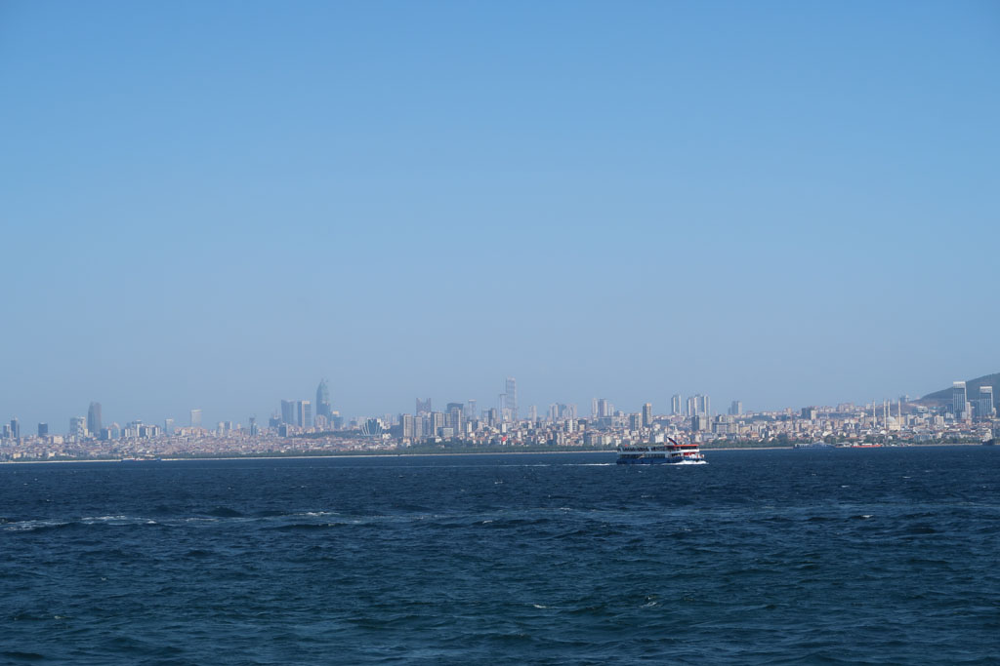
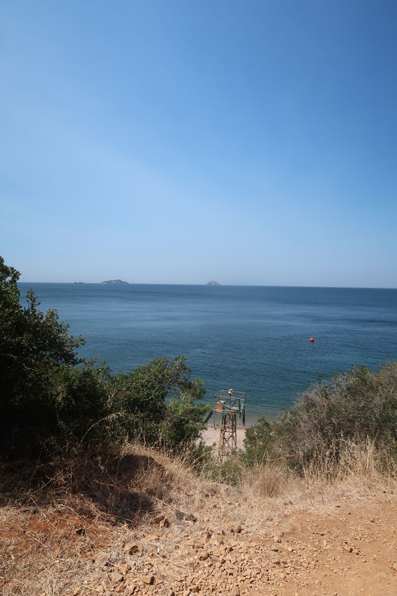

Dernière journée complète à **Istanbul**.

Grande excursion. Nous prenons le train de ***banlieue*** à la *Sirkeci Train Station* pour la station de ***Maltepe*** située sur la rive asiatique.

De là nous prenons un ferry pour une des *iles aux princes*, l'ile de **Burgazadası**. Nous faisons le tour de l'île par le nord pour rejoindre la plage de **Madam Marta Koyu**.

Passons un bon moment à nous prélasser et baigner avant de prendre le chemin du retour. Un ferry arrive, du coup nous ne mangeons pas et retournons directement sur *Kadikoy*

De ce que je me souviens, nous sommes retourné prendre un thé dans les jardins de la petite sainte Sophie (Église des Saints-Serge-et-Bacchus / Küçük Ayasofya Camii).

Après êtres revenus dans le quartier d'*Eminönü* nous sommes remonté profiter de la vue et de l'ambiance nocturne des jardins de la superbe **mosquée** *Süleymaniye*