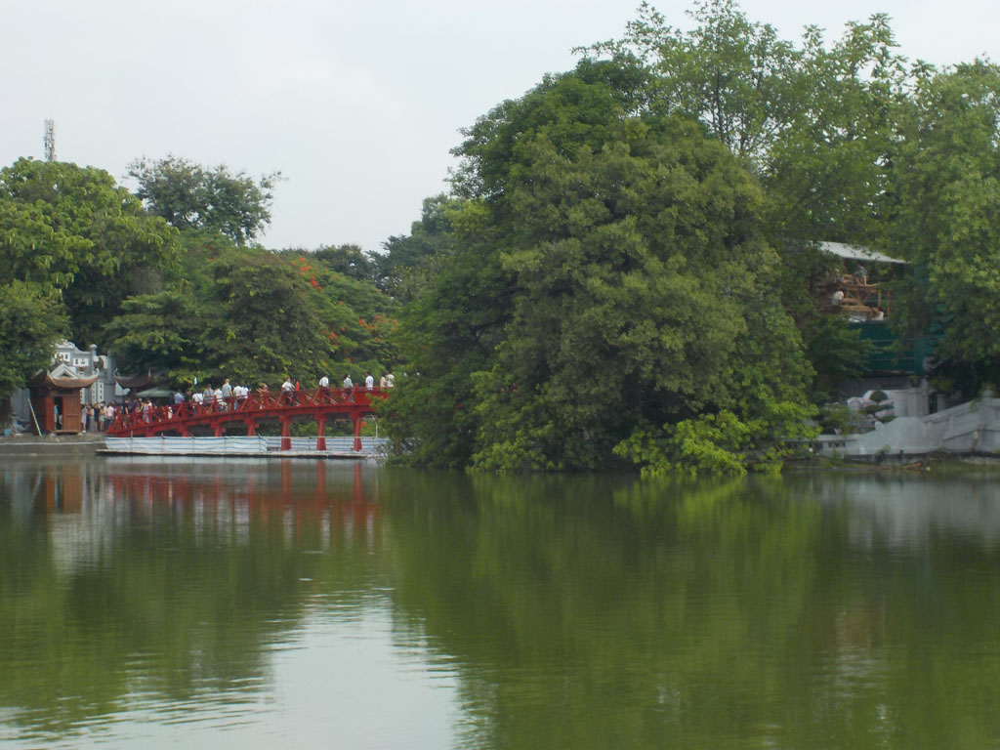

13h15 nous arrivons à **Hanoï**. Nous sommes récupérés à l’aéroport. On nous emmène à l’hôtel. Nous sommes situé dans une ruelle du vieil Hanoï, face à un petit temple de quartier.

Partons de suite faire le tour du lac. L’ambiance est sympa, c’est le weekend et le centre ville et les abords du lac sont piétons. Nous prenons nos premiers beignets tout en conversant avec un petit garçon et son papa en anglais, il voulait que son fils s’exerce.

Retour à l’hôtel après une pause bière dans une petite ruelle.

On ressort se perdre dans le quartier. Nous mangeons sur les petits tabourets bleus à même le trottoir. Un régal. Lamelles de porc, nems de crabe, herbes, ail + piment, bières et sodas.

Retour tranquille à l’hôtel pour un gros dodo.