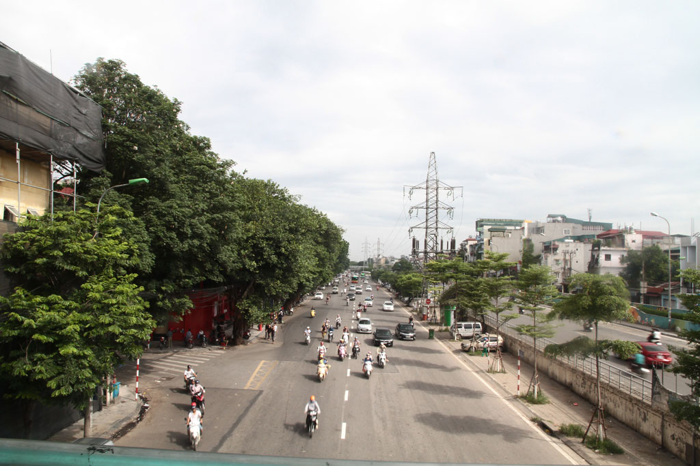
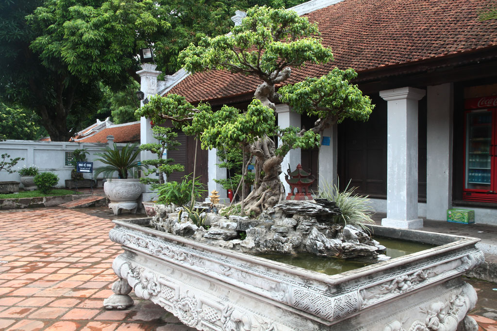
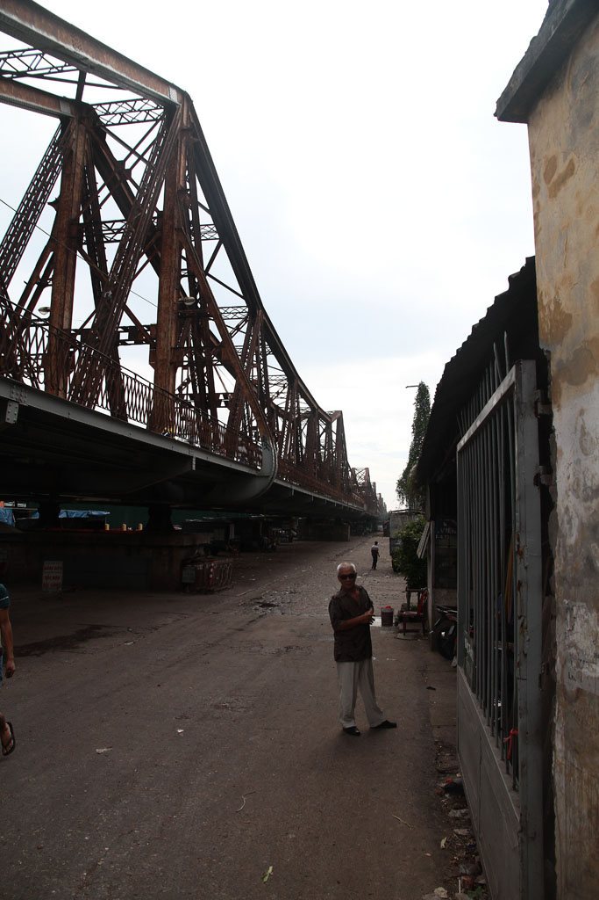

Après un solide petit déjeuner à l’hôtel, nous voilà prêts à partir à la découverte de la ville d'**Hanoï**. Grand tour dans les différentes rues organisées par métiers.

Pause café en face de la citadelle.

Passage devant le mausolée d’Ho. Visite du **musée des beaux arts**. Repas dans un petit restaurant pendant que l’averse s’abat sur la ville. Riz frit et boeuf, nouilles végétarienne, bières, sodas.

Le soleil revenu nous visitons le **temple de la littérature**.

Retour à l’hôtel pour une petite sieste.

On va faire une tour au BBQ hôtel, profiter de la vue sur le lac et le carrefour, autour de bières et de jus de fruits.

Passage par la case douche avant de ressortir dans la ville se prendre un Phô dans une petite gargote.

Balade nocturne et digestive autour du lac.

Dodo

