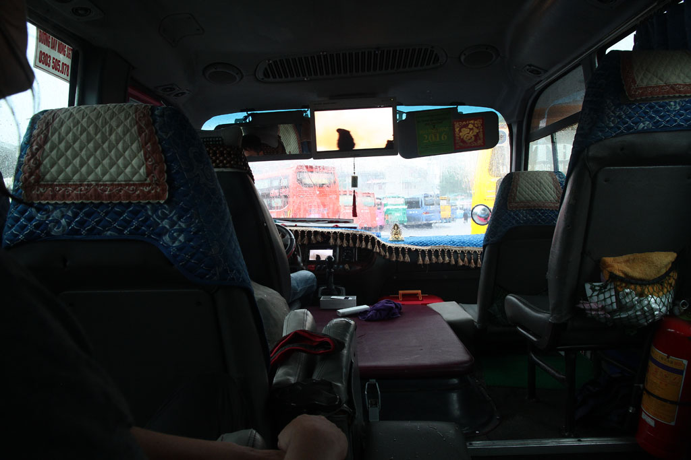
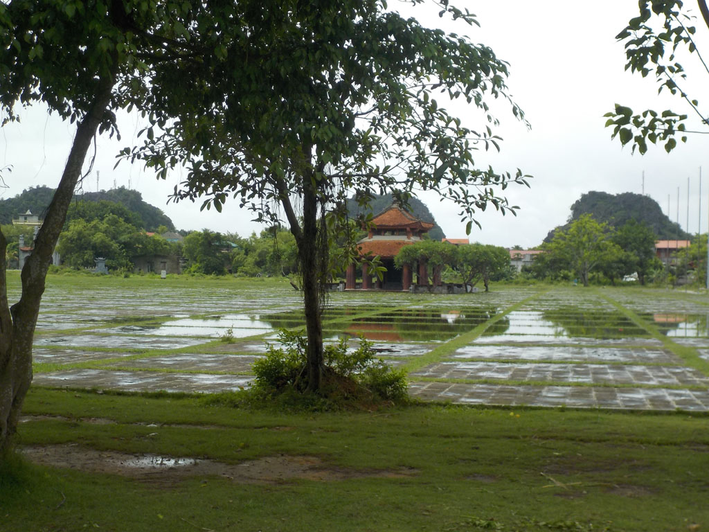
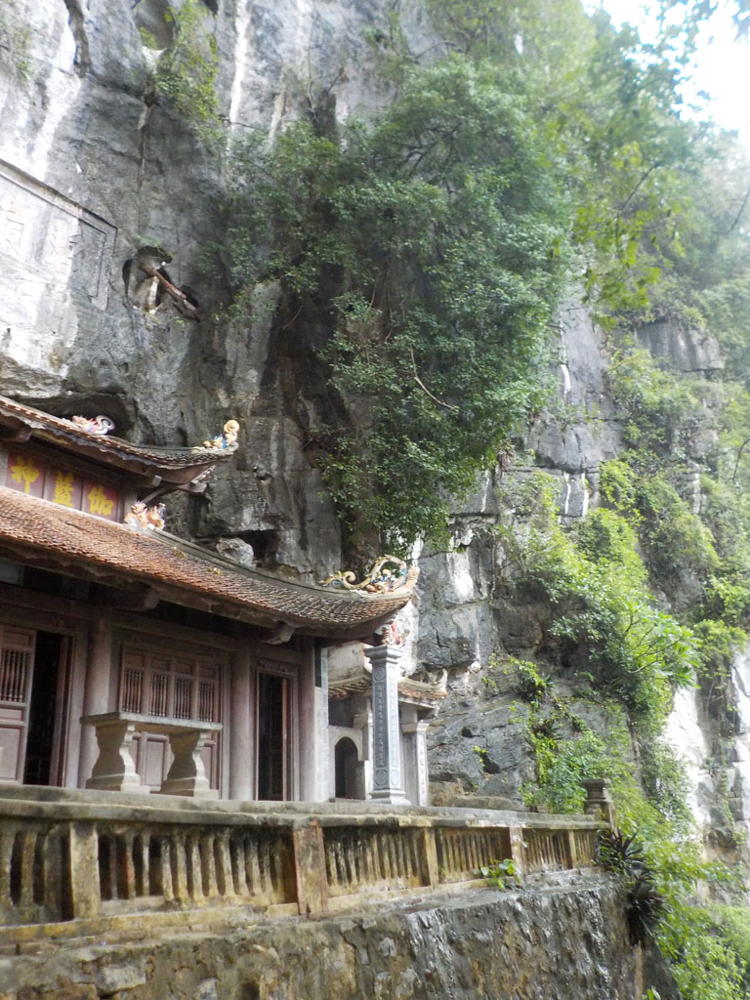
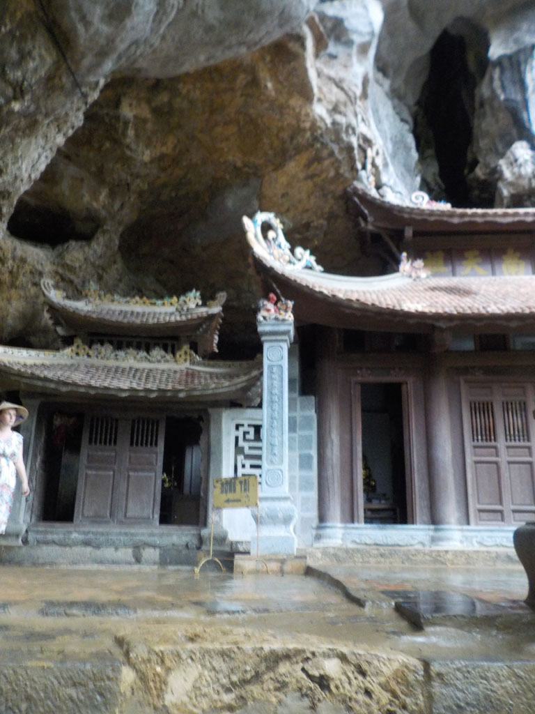
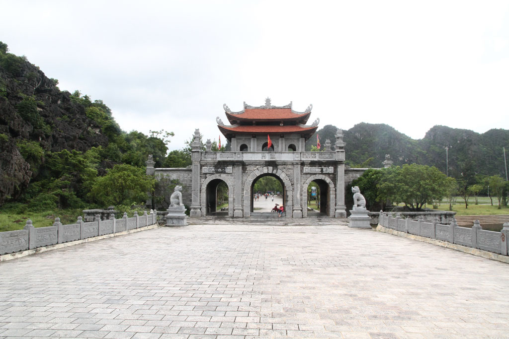
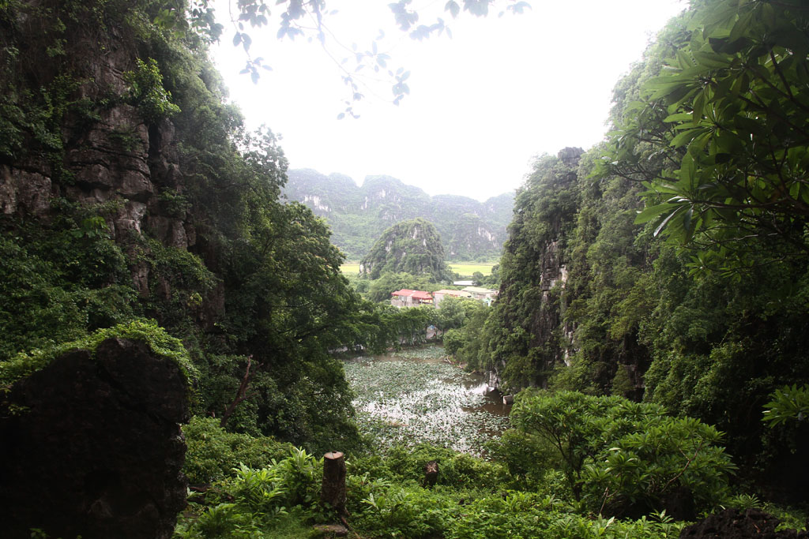
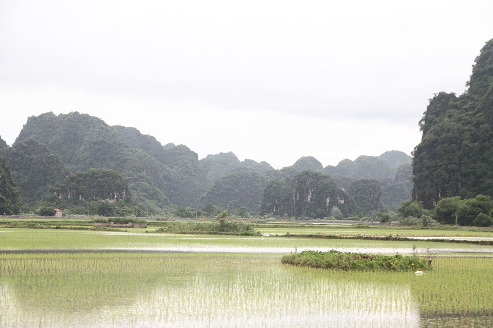
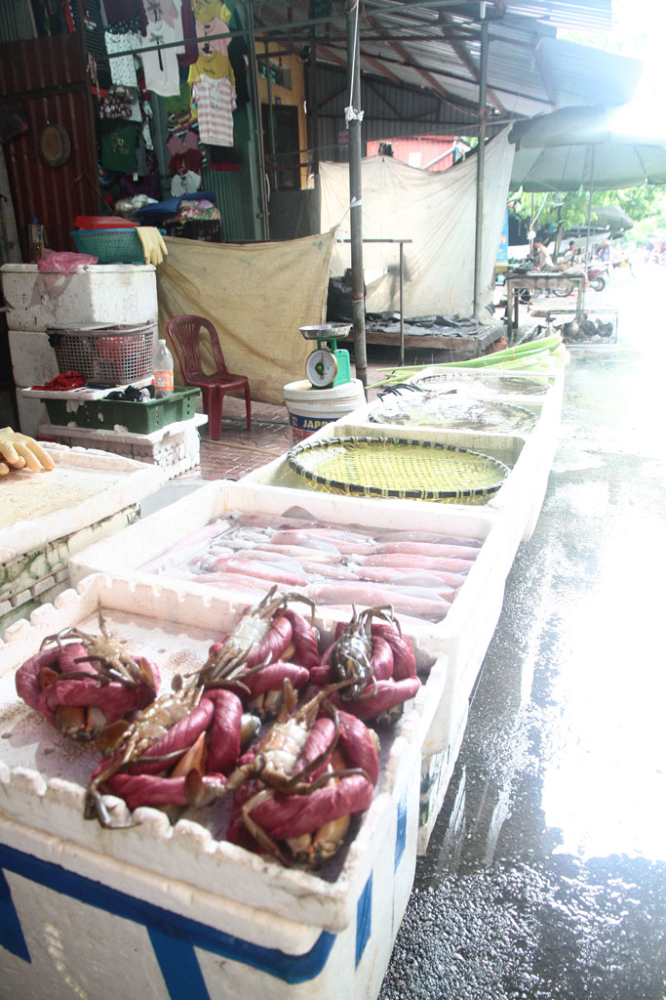
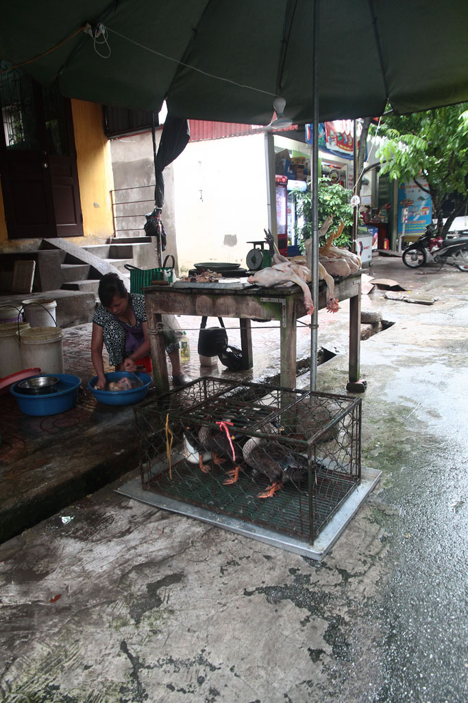

Nous prenons un taxi sous des trombes d’eau pour la gare routière de Giapbat d'**Hanoï** inondée. Les billets achetés au comptoir, nous pataugeons dans 20 cm d’eau pour rejoindre le bus qui nous emmène à **Ninh Binh**. Des tongs flottent ici et là.

Une fois arrivé nous prenons un taxi pour la guesthouse. On part de suite en balade, mais ne trouvons rien à manger. C’est le début de l’après midi, le marché est terminé. Du coup on prend un chauffeur après négociations pour aller visiter les alentours. Nous allons à **Hoa Lu** et à la **pagode de Jade**.

Nous revenons ensuite à la guesthouse, prendre une bière puis ensuite manger sur place. Un riz “végétarien” au poulet, du porc avec des nouilles, bières et sodas.

A la fin du repas, nous faisons un aller retour à la gare acheter des billets pour le lendemain.