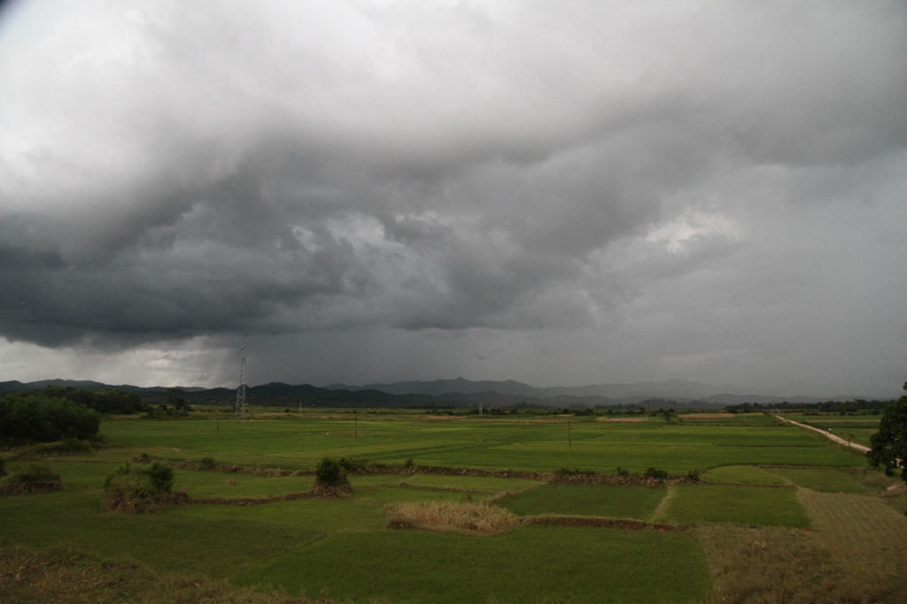
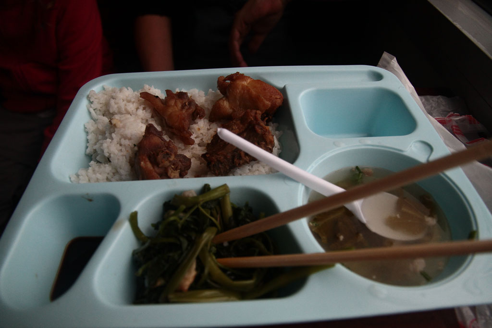
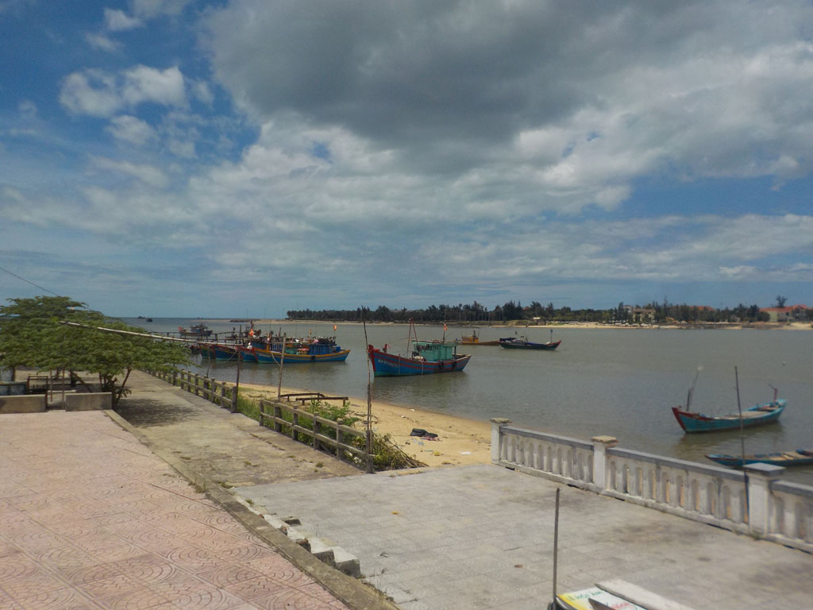

Après café et jus de fruits nous prenons un taxi pour la gare.

8h00 de train “Hard Seat” pour **Dong Hoy**, où nous prenons un taxi pour l’hôtel.

Pause bières et sodas. Balade dans la ville.

Repas dans un petit restaurant non loin de notre logement, légumes riz boeuf ou oeuf, eau.

Balade digestive sur le **port**. Petites crêpes dessert à l’hôtel avant de dormir.