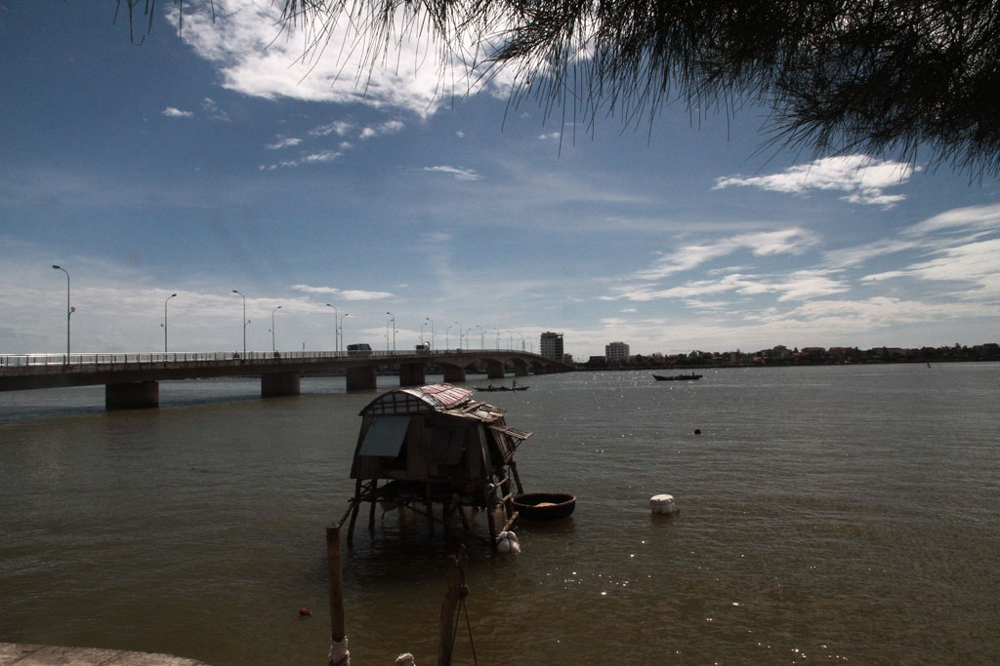
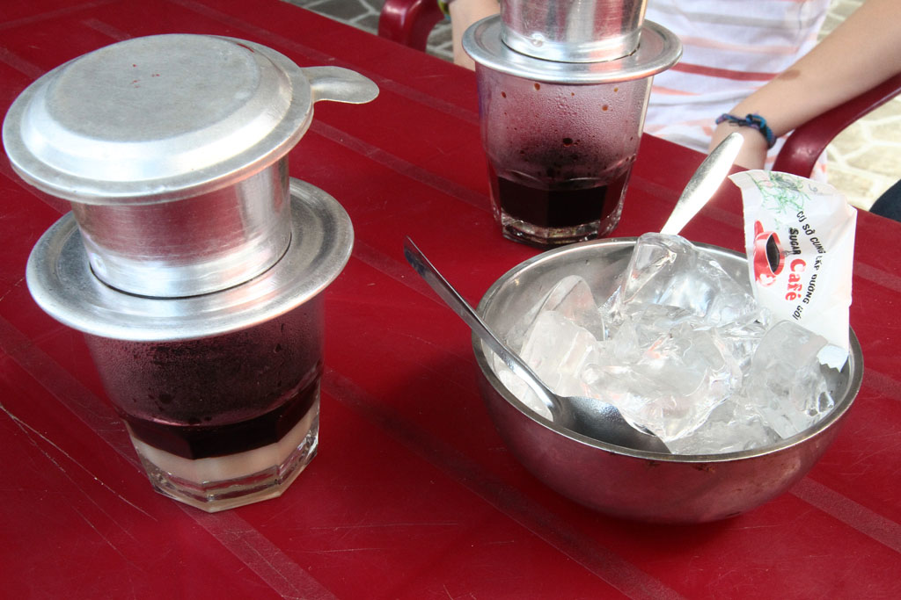
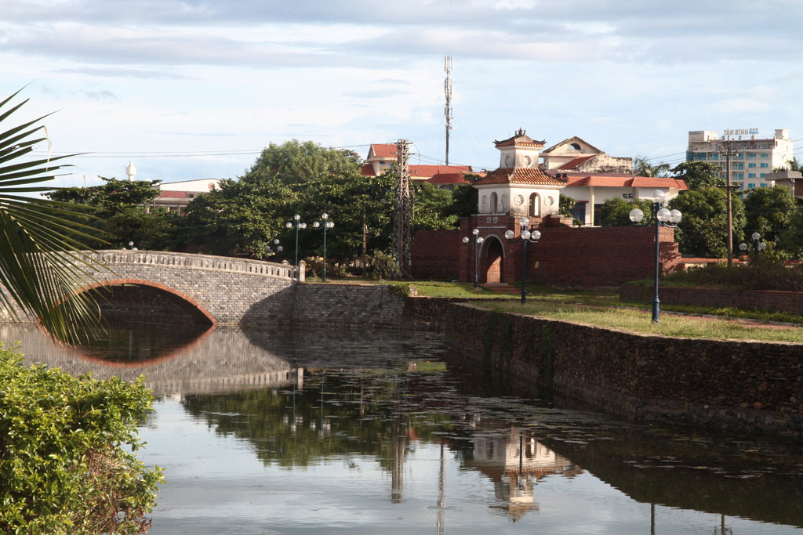

Petit déjeuner à la guesthouse suivi d’une balade le long de la rivière dans cette ville de **Dong Hoy**. Passage par le marché. Nous prenons ensuite un petit café glacé en terrasse face à ce dernier. Retour par la citadelle et les magasins des couturiers.

Pause bière/jus de fruits vers midi dans la vieille ville avant de revenir à l’hôtel le temps d’une petite sieste.

Retour sur le port, nous dégustons les spécialités locale dans un petit restaurant, le Tu Quy.

Fin d’après midi paisible au bord de l’eau avant de rentrer à la guesthouse où nous prenons notre repas du soir, riz sauté aux légumes et nems.