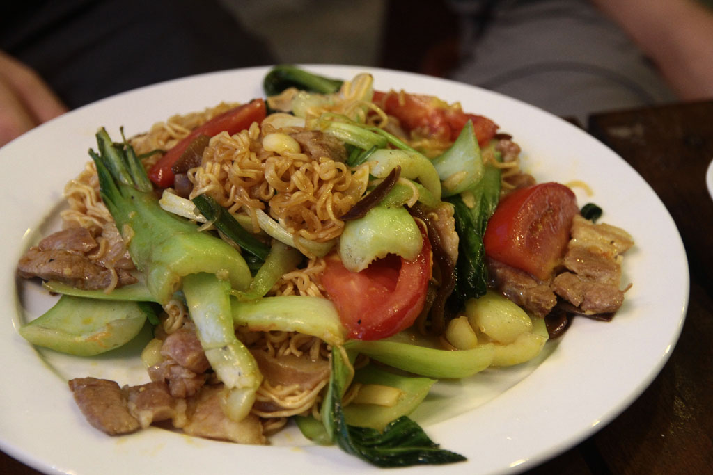
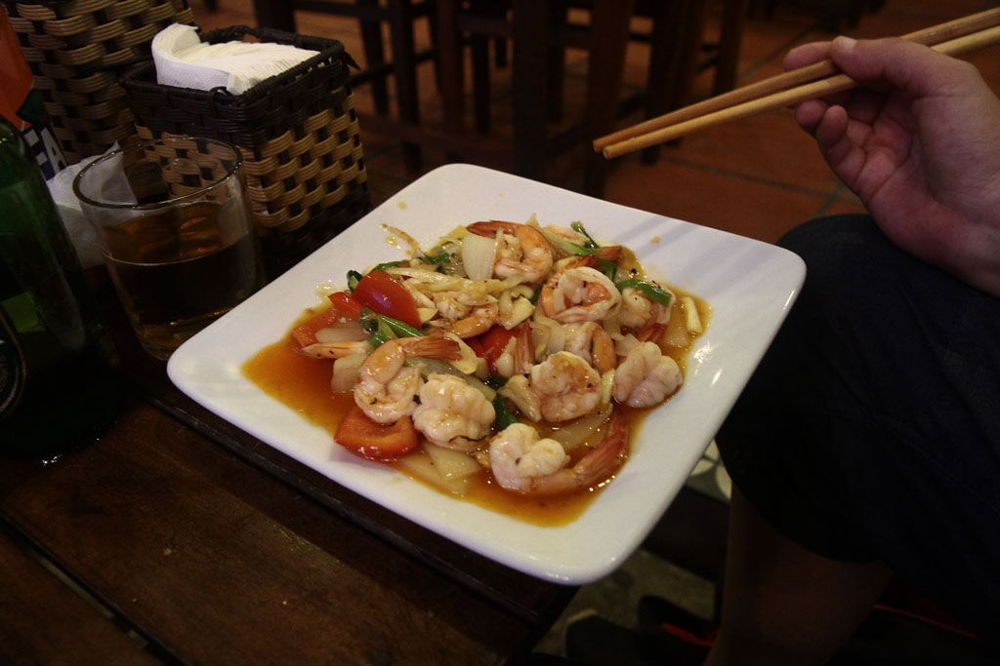
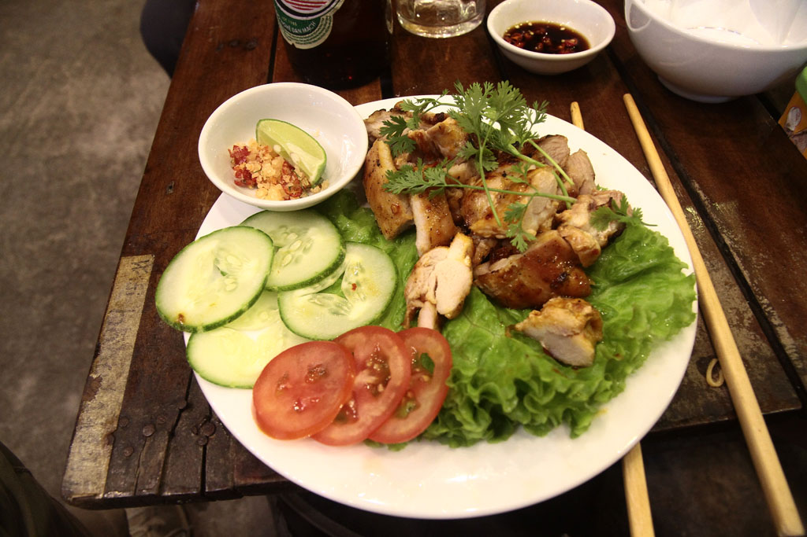

6h30 Réveil. Une fois les sacs bouclé nous prenons un taxi pour la gare.

7h40 train en sièges inclinables.

10h35 Arrivée à **Hué**. L’hôtel que nous avions sélectionné, un grand building sans âme est plein de groupes. On nous propose de nous loger dans l’annexe, une petite maison dans une ruelle avoisinante. Ils sont navrés, mais nous sommes ravis. Une fois les sacs posés nous parons en balade dans la ville. Petits encas sur une terrasse couverte, brochettes de porc à la citronnelle et riz sauté.

Retour à notre logement en faisant un arrêt au **Kore**, petit café au bord de la rivière.

Sieste.

18h30 à la recherche d’un restaurant, nous nous arrêtons au B-41, situé entre plusieurs restaurants à touristes, c’est le seul où les locaux s’arrêtent. Nous y mangeons très bien. Nouilles sautées au porc, barbecue de porc, crevettes sautées, bières et sodas. Nous rentrons à la nuit tombée avec une petite pause au **Kore** (passion x2, citron et café).

Tandis que les enfants sont couchés nous avons une longue discussion passionnante avec le gardien de nuit sur les marches extérieures.

23h00 dodo