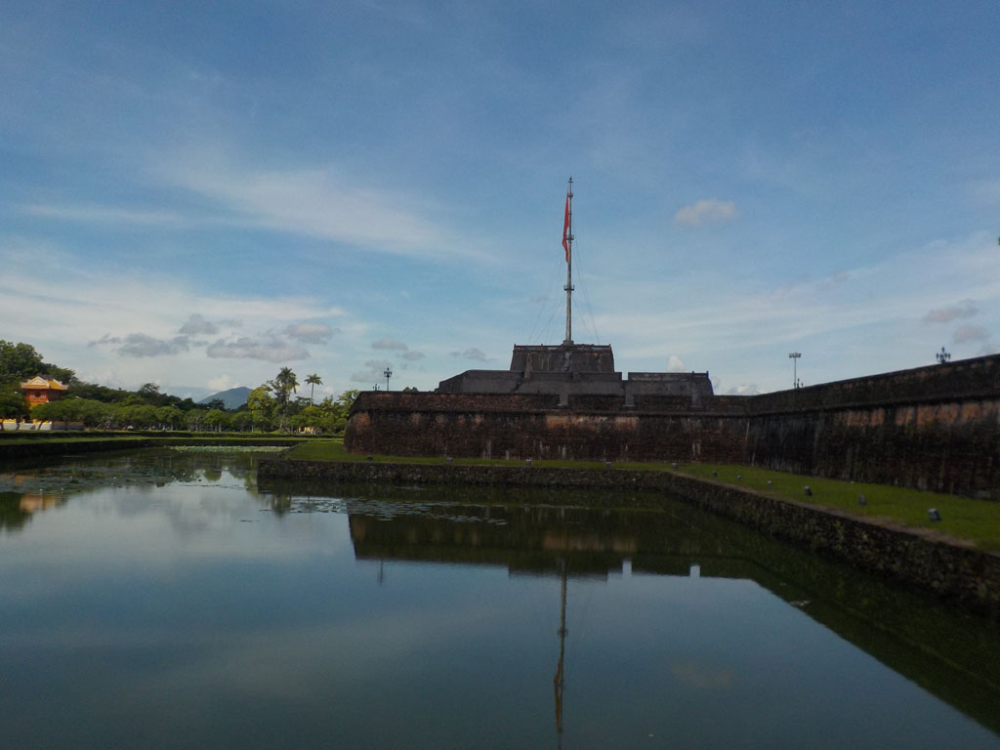
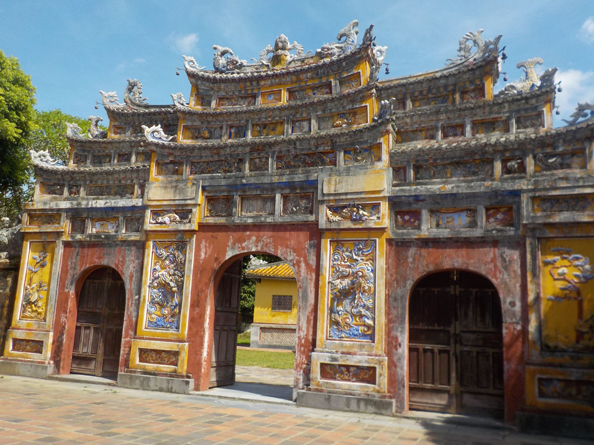
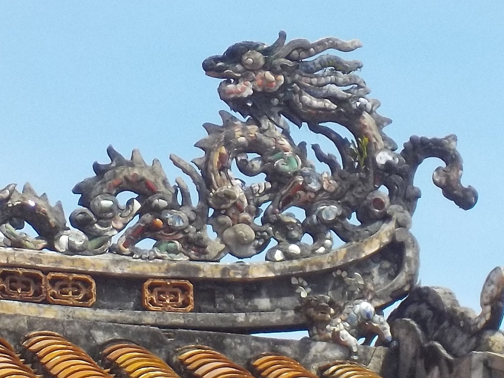
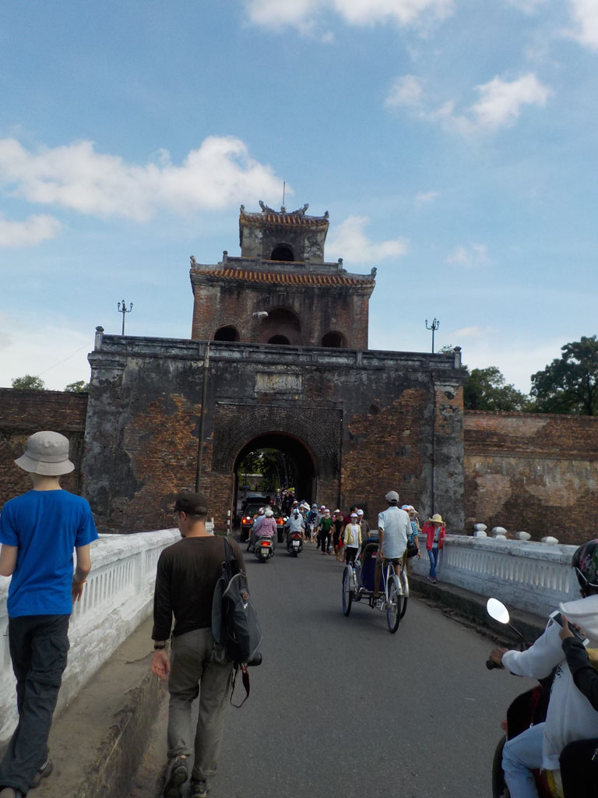
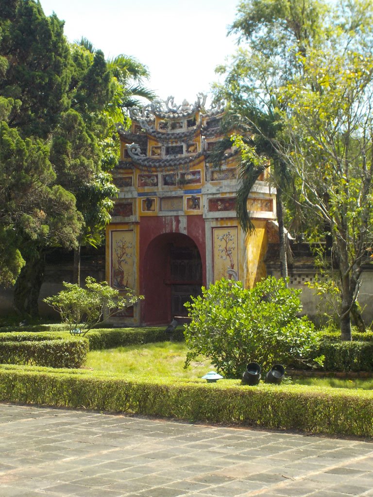
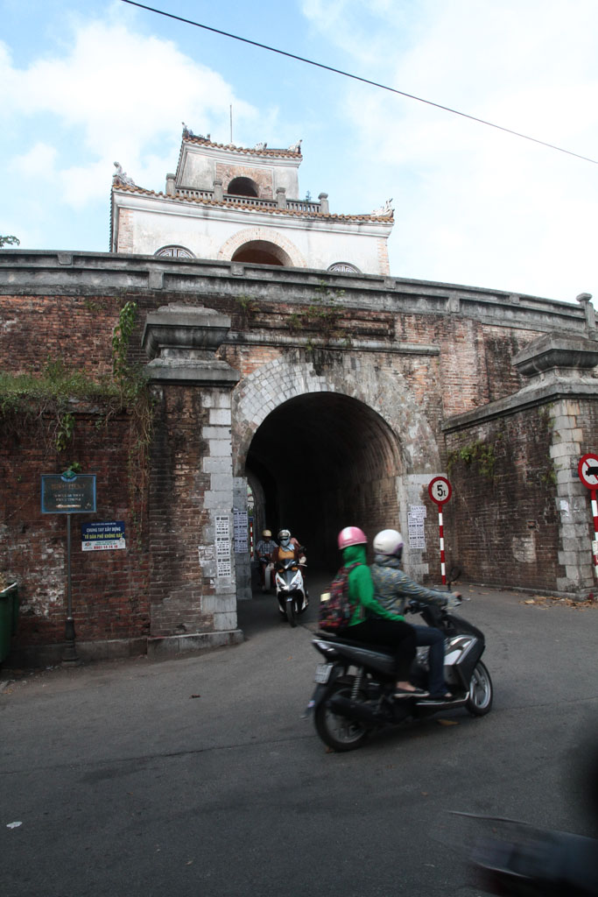

6h30 Réveil. Bon petit déjeuner à l’hôtel, oeufs café, pancake banane chocolat, fruits.

Nous marchons jusqu’à la citadelle en passant par un supermarché acheter de l’eau et des gâteaux.

Petite pause café en terrasse après la chaleur de la marche.

8h30 achat des tickets. Nous visitons ensuite la **citadelle** de **Hué** jusqu’à 13h30. La plupart des groupes se contentent d’une toute petite partie. nous sommes rapidement seuls dans ce merveilleux endroit.

Nous ressortons par le coté de la citadelle et allons ensuite visiter le musée, gratuit et très beau pendant 1h.

Dans un petit café local, chez Cathy, on se repose un peu. Passion x2, citron salé, café frappé.

Balade dans la vieille ville, somptueuse.

16h30 nous prenons finalement un taxi pour rentrer.

Avec l’aide de notre hôtel nous trouvons difficilement un hôtel à **Hoi An** par téléphone et nous achetons les billets de bus pour le lendemain. Douche et sacs bouclés on ressort manger au B-41.

Bien fatigués nous rentrons dormir vers 20h30.