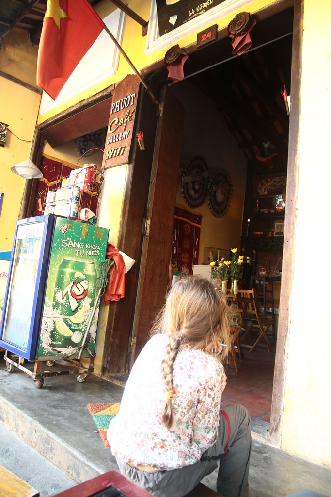
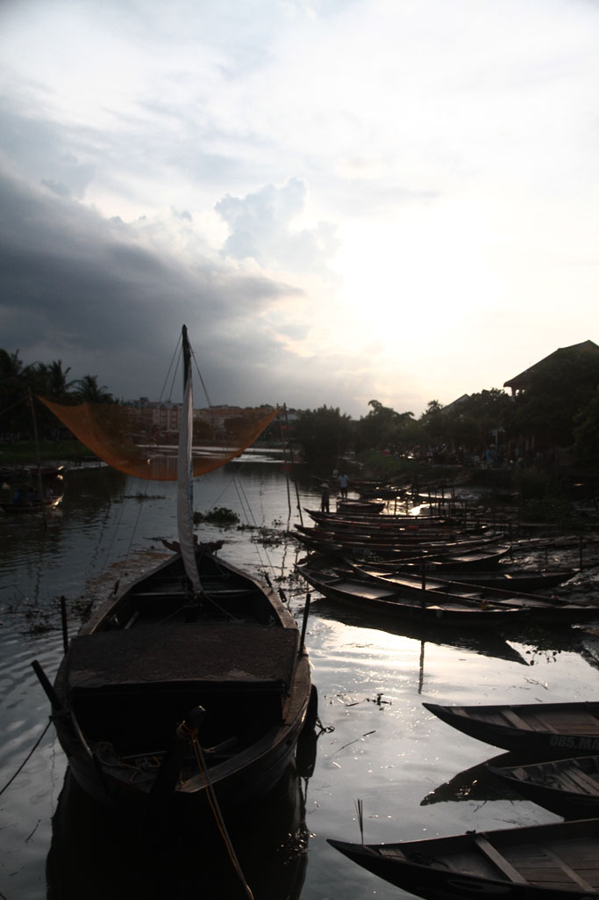
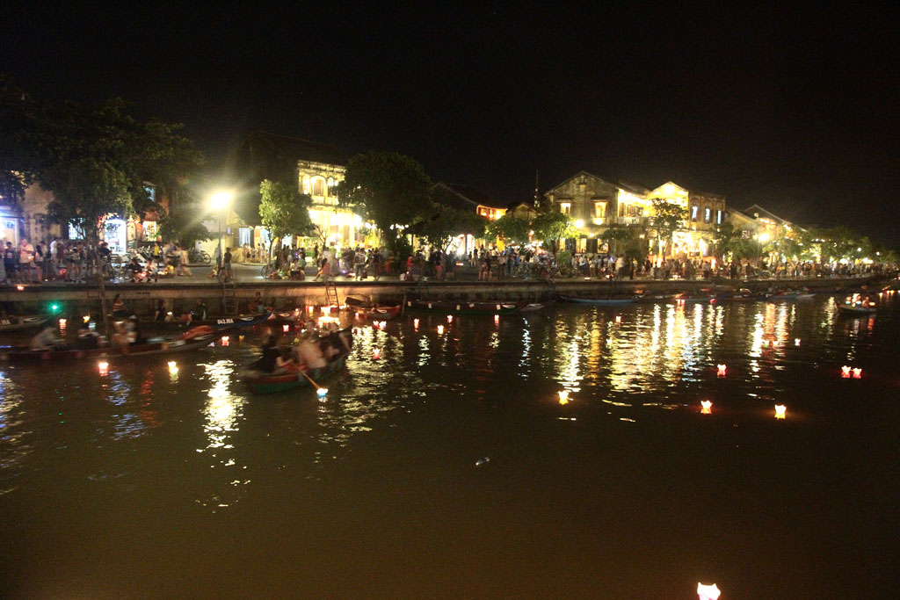

6h30 Réveil. Bon petit déjeuner à l’hôtel, oeufs café, pancake banane chocolat, fruits.

Un mini bus vient nous chercher pour nous amener à un grand bus couchettes. Voyage sous le soleil avec un arrêt chips + eau. Nous traversons **Danang**, chantiers gigantesques de resorts à n’en plus finir tout le long de la cote. Arrivés à **Hoi An** nous prenons un taxi pour notre hôtel. On nous offre un thé glacé en attendant que la chambre se libère. Douche, et petite sieste pour tout le monde.

16h00 On retourne en marchant vers le centre ville. Nous en profitons pour boucler un “tour” pour le lendemain dans une agence.

Achetons ensuite, bien malgré nous les tickets pour rentrer dans la vieille ville *(il aurait fallu continuer un peu plus loin que les 2 accès que nous avons croisé pour pouvoir s’en passer).*

Pause bière sur un trottoir et “visite”. Impression d’être à Disneyland. C’est beau mais cela semble totalement artificiel.

Après quelques errances nous trouvons enfin une gargote au bord de l’eau, sur le débarcadère de l’autre coté de la ville.

Retour à travers la ville à la recherche de petits gâteau pour le lendemain. On s’abrite d’une grosse averse au café 43 avant de rentrer finalement à la guest house.