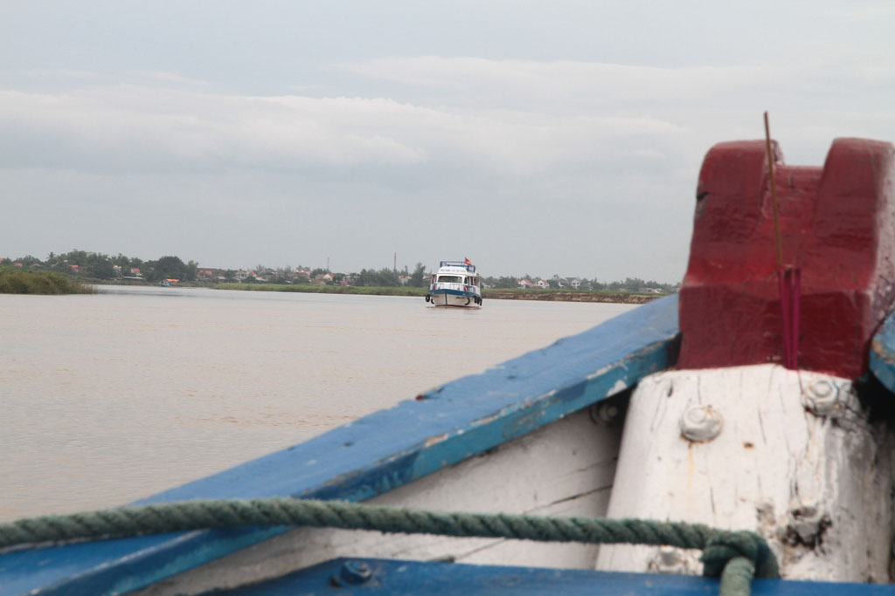
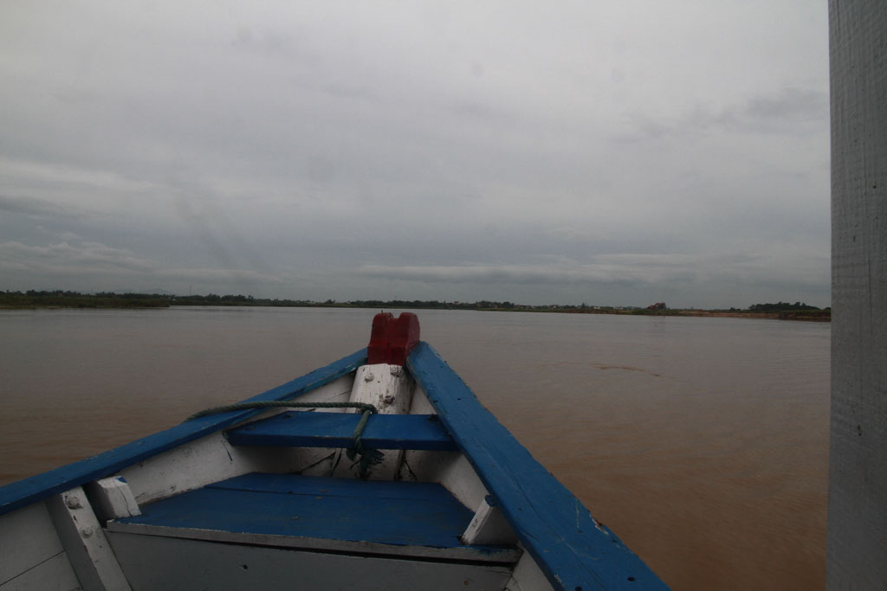
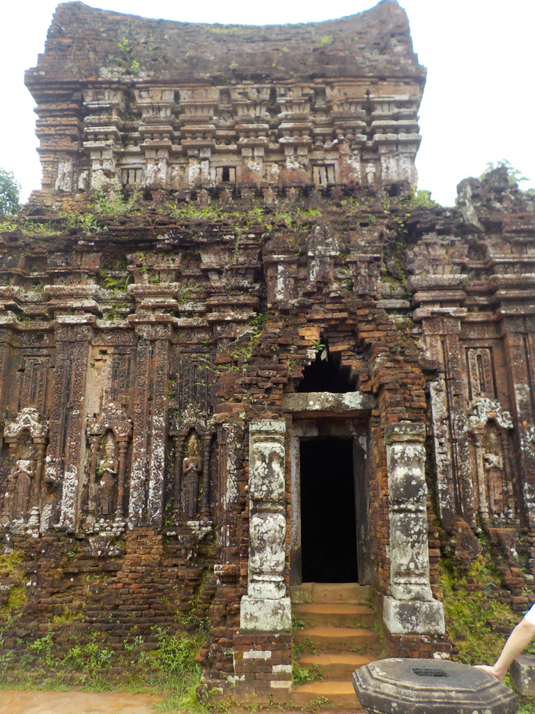
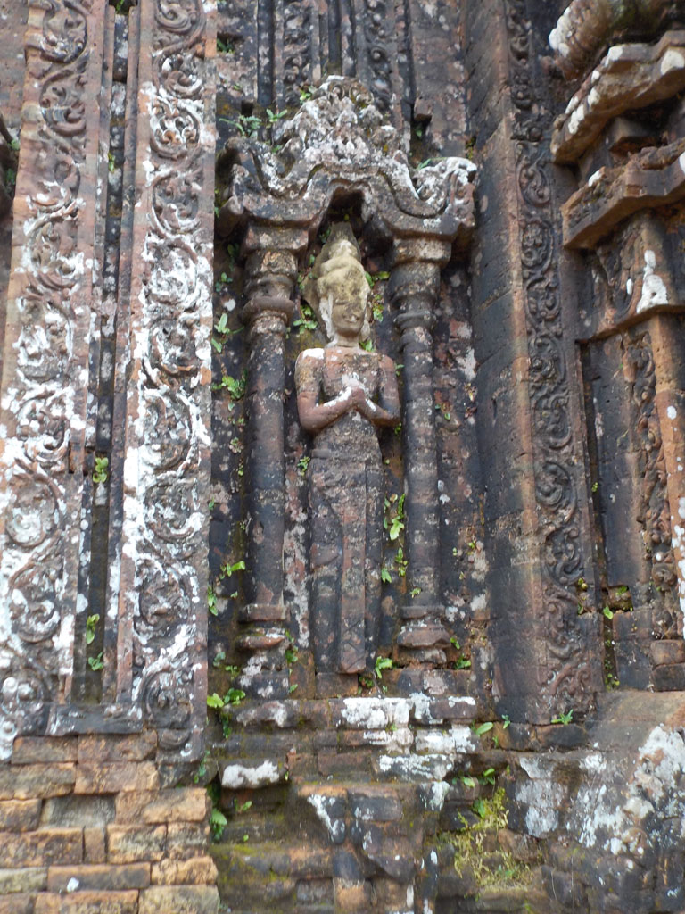
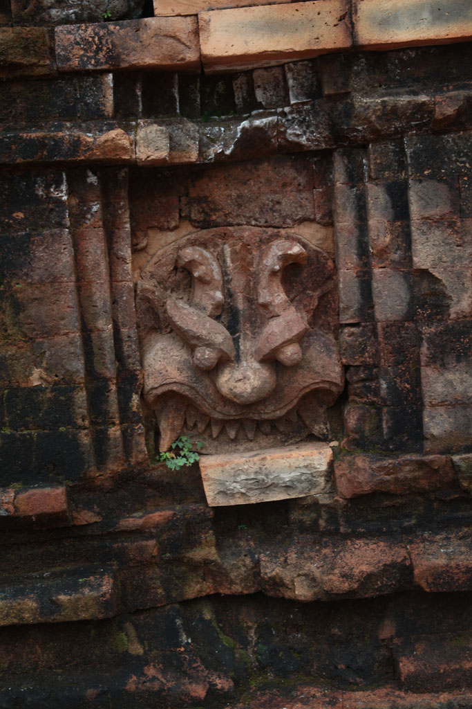
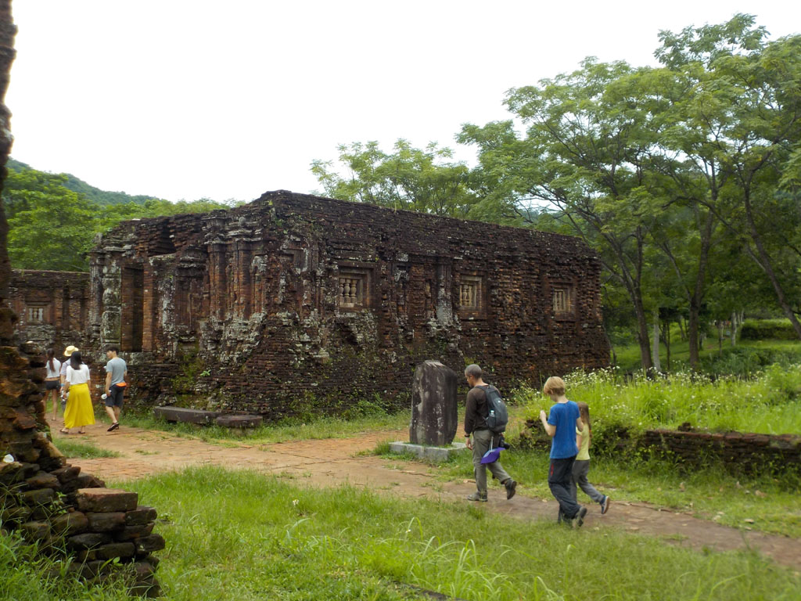
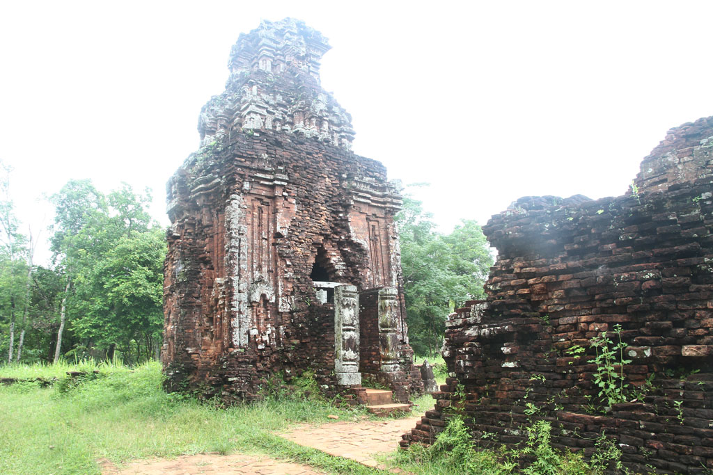

6h30 Réveil. Bon petit déjeuner à guesthouse, tout le monde se cale en prévision de la balade, pancakes banane, cafén ban my, oeufs, jus banane, jus citron, et cafés sont vite expédiés.

Notre tour nous emmène jusqu’à **My Son**, très belle balade, nous ne sommes pas très nombreux et nous revenons à **Hoi An** en mangeant sur le bateau qui nous y ramène.

Nous restons sur le port savourer une bonne bière. Nous partons ensuite à la recherche d’un moyen de quitter la ville le lendemain. 2 agences de voyage plus tard je me rend à la gare routière pour tenter de connaître les horaires. Je suis le seul touriste, on tentera le coup, il n’y a aucun guichet.

Nous retournons en ville, sur le port comme la veille, sans payer cette fois ci. Nous mangeons au même endroit, sur nos petits tabourets, pancake crevette, riz sauté au poulet, bières et jus de citron.

Retour à l’hôtel où nous bouclons les sacs après une bonne douche