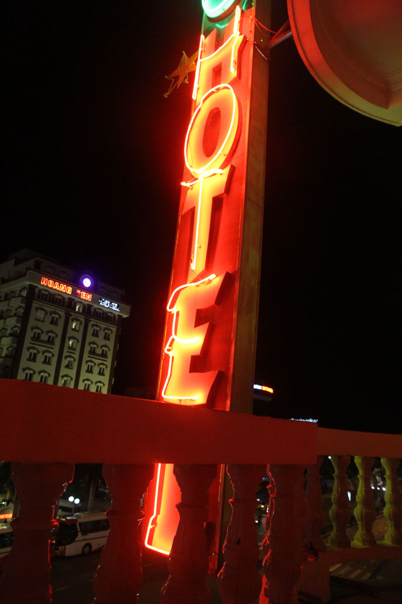

6h30 Réveil. Pancakes, oeufs, cafés, eau.   
  
Taxi jusqu’à la gare routière. Nous prenons un bus pour **Danang**, on paye plus cher que les autres, mais c’est le jeu et ça fait rire.   
  
De la gare de routière de **Danang** (10h30) on trouve un autre bus pour **Quy Nhon**. Nous mettrons 5h à fond de train.   
  
De la gare routière on prend un taxi pour un hôtel repéré dans le routard, mais ce dernier est en démolition. Celui d’à coté est à peine logeable, tant le bruit et la poussière de la démolition de son voisin sont violents. Dans le 3eme la chambre hors de prix n’a que 2 lits et se trouve être sans fenêtres. Sur le point de partir, sacs sur les épaules, une grande chambre face à la mer au même prix se libère subitement.

On part le long de la mer vers la vieille ville, on y repère un autre hôtel que nus réservons pour le lendemain. Nous continuons de nous balader le long de la mer avant de nous arrêter boire bières et jus de fruits. Nous sommes les seuls touristes et nous défrayons un peu la chronique. On va jeter un coup d’oeil aux 2 restaurants recommandés par le guide du routard. Les prix sont stratosphériques et l’accueil peu aimable. Du coup on retourne à l’endroit où nous venons de boire un verre, plus local et beaucoup plus sympathique. Nouilles au boeuf, vermicelles au crabe, grenouilles grillées au piment, bières et jus de fruits.

Nous revenons ensuite à notre hôtel par la plage. Le bistro à coté affiche des prix qui ne sont pas pour nous, du coup nous arrivons chez Barbara prendre cafés frappés et jus de citron.