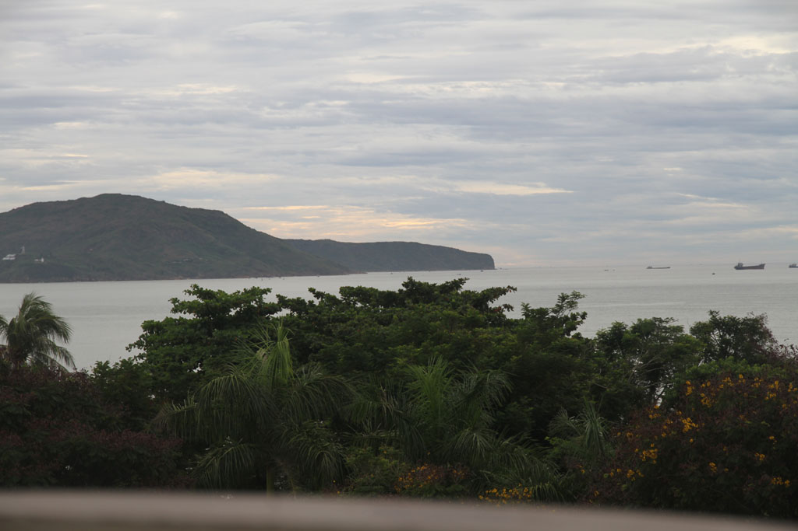
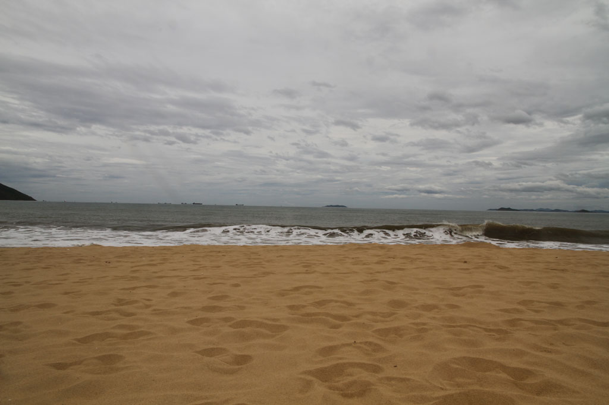

Ce matin grasse matinée. Notre hôtel ne sert pas de petit déjeuner, du coup vers 10h00 après avoir bouclé les sacs nous prenons un taxi pour le nouvel hôtel. Notre chambre est déjà prête.

Après avoir posé les sacs, grande balade dans la vieille ville de **Quy Nhon**. Il est trop tôt pour manger, et trop tard pour déjeuner. Ce sera pause café jus non loin de la mer.

Retour à l’hôtel pour une grosse sieste. Je pars pendant ce temps là dessiner et acheter des cigarettes. Je vois la pluie s’approcher, retour rapide mettre les maillots de bain.

16h00 baignade sur la **plage** municipale avec tous les habitants du quartier, l’ambiance est super sympa. On rentre ensuite se doucher dans notre chambre.

A la recherche d’un endroit sympa où manger, on découvre une immense cantine-hangar sur une rue parallèle à la plage mais plus à l’intérieur de la ville. Très bon repas. Nouilles sautées aux légumes, crevettes à l’ail, crevettes sel et piment, bières et cocas.

Retour enfin à l’hôtel où l’on s’endort au son des cabines de karaoké situées à l’étage du dessous.