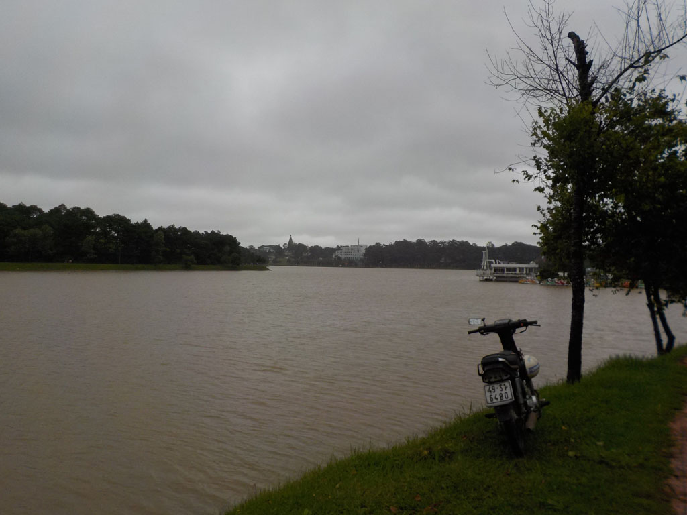
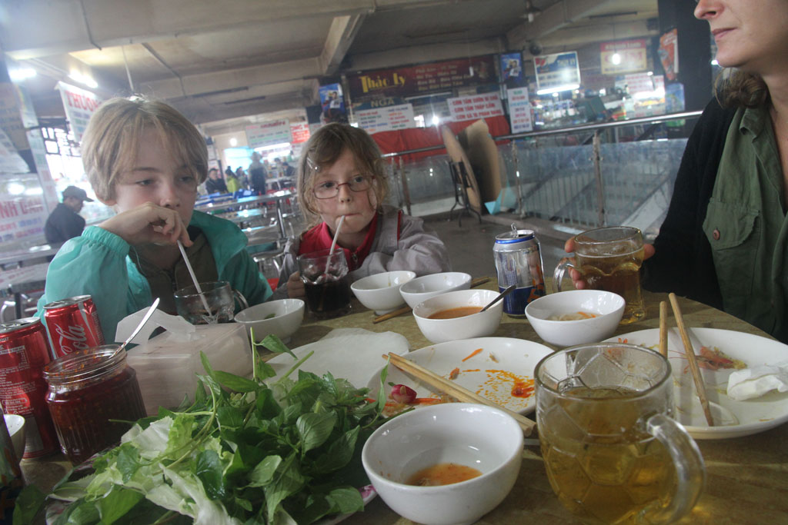

En descendant nos sacs nous découvrons que nous avons le droit à un petit déjeuner, oeufs, fruits, café.

Nous déposons nos sacs dans notre nouvel hôtel.

On rencontre dans la rue un couple de français.

Direction la gare routière en taxi acheter nos billets pour le lendemain.

Taxi pour la gare ferroviaire (billet d’entrée) où nous achetons nos billets pour l’excursion en train de 14h00.

Retour en taxi pour le **marché** de **Đà Lạt** de où l’on se perd avec bonheur dans les étals. Nous mangeons évidement sur place.

Taxi pour la gare, où l’on retrouve le couple de français du matin. On passe le reste de l’excursion avec eux, balade entrain au milieu des serres en plastique et des pesticides. Visite de la pagode et de son enfer, retour en train.

Nous revenons tous ensemble de la gare à pieds, en achetant des beignets de banane délicieux sur le bord de la route.

Petite pause à l’hôtel avant de ressortir manger au **DaQuy** des crevettes aux légumes, porc sauce aigre douce, nems végétariens le tout avec riz bières et sodas.