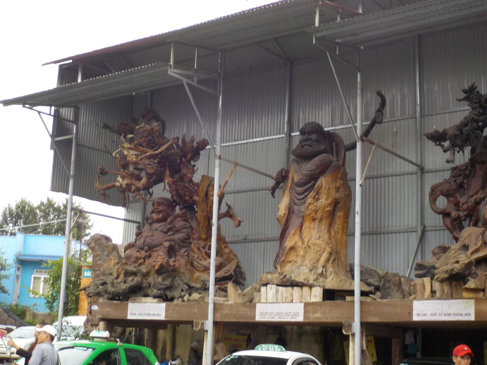
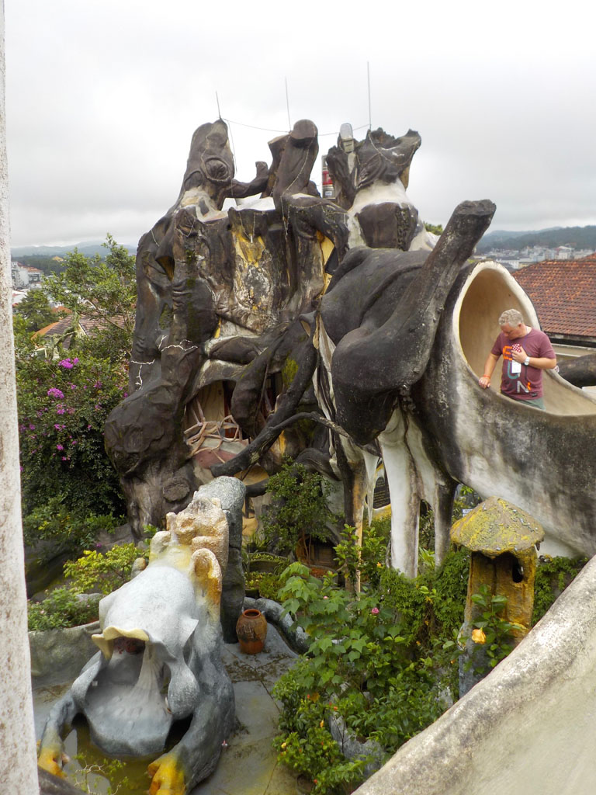

8h30 petit déjeuner à l’hôtel, pancakes, oeufs, thé, cafés.

Nous prenons ensuite un taxi pour la villa “Folie”, puis nous marchons jusqu’à la résidence d’été BaoDaï, visite des lieux.

Retour en taxi à notre hôtel où l’on règle la note et on laisse nos sacs.

Cafés, sodas dans une petite gargote avant de prendre un taxi pour le musée de la broderie. Très impressionnant et passionnant. Nous y sommes relativement seuls.

Taxi pour le centre ville.

Balade et patisserie.

Pause cafés sodas pendant qu’une grosse averse s’abat sur la ville.

On repart en balade pour finir dans une petite gargote dénichée par les 2 français croisés la veille. Assortiment de nems, nouilles, feuilles, cochon, etc… bières et sodas. Nous mangeons d’ailleurs un peu trop..

18h30 retour à l’hôtel où en compagnie de nos sacs nous attendons la navette.

19h20 la navette nous emmène au bus.

20h00 départ pile à l’heure. La descente de la route de montagne de nuit, en plein brouillard avec les camions dans l’autre sens est impressionnante. 2 arrêts pipi, bouffe sur le trajet.