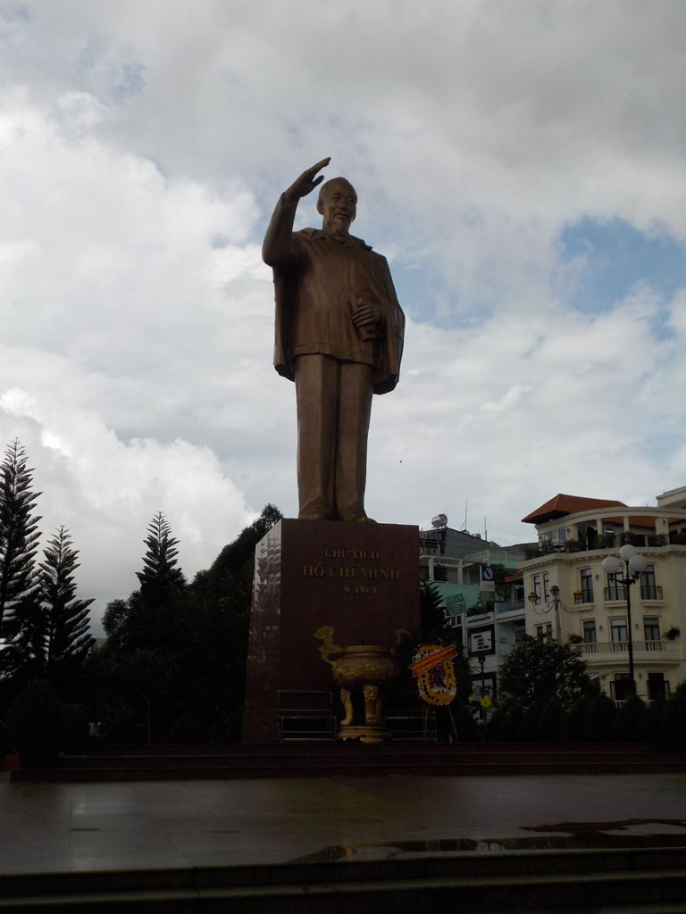

5h00 Pensant à un nouvel arrêt je descends fumer une clope quand je vois nos sacs sortirs du coffre du bus. Nous sommes arrivés à **Cần Thơ** avec 2 heures d’avance.

Nous attendons 6h30 avant de prendre un taxi pour le quartier des hôtels. Le premier est plein, pour le deuxième il faut attendre 30min ou jusqu’à midi (pas compris). Du coup nous repartons seuls, le 3eme est lui aussi complet. On essaie la guesthouse du coin, dans une petite allée, elle semble fermée, quand soudain la porte d’entrée s’ouvre et au même moment le proprio rentre de sa gym en scooter. Il y a une chambre pour nous et pas trop chère 250 000. YES

8h30 nous prenons un petit café dans la rue juste à coté.

9h00 on part en balade dans la ville, pagode, musé, temple chinois. On termine sur les quais boire un très bon jus de fruits.

On commence à se renseigner auprès des agences locales pour une excursion le lendemain. Toutes proposent pour 42$ au minimum 3h de balade et 1 seul marché flottant et un départ vers 7h00.

12h00 Repas à la cantine du coin (n°16), riz porc, riz poulet, sodas et bières très bons.

13h30 Discussion avec la patronne de notre house pour la balade du lendemain. On tombe d’accord sur un circuit de 7h00, 2 marchés et un départ à 5h00 du mat pour 40$.

Tentative de sieste.

Balade sur le marché situé non loin.

Café jus de citron dans le café tenu par des jeunes fans de basket.

Direction le Mékong pour le repas du soir, curry de crevettes, claypot pork, nems, bières et sodas. Tout était bon sauf les nems.

Sur le retour on s’arrête dans le parc municipal, profiter du concert

21h30 dodo