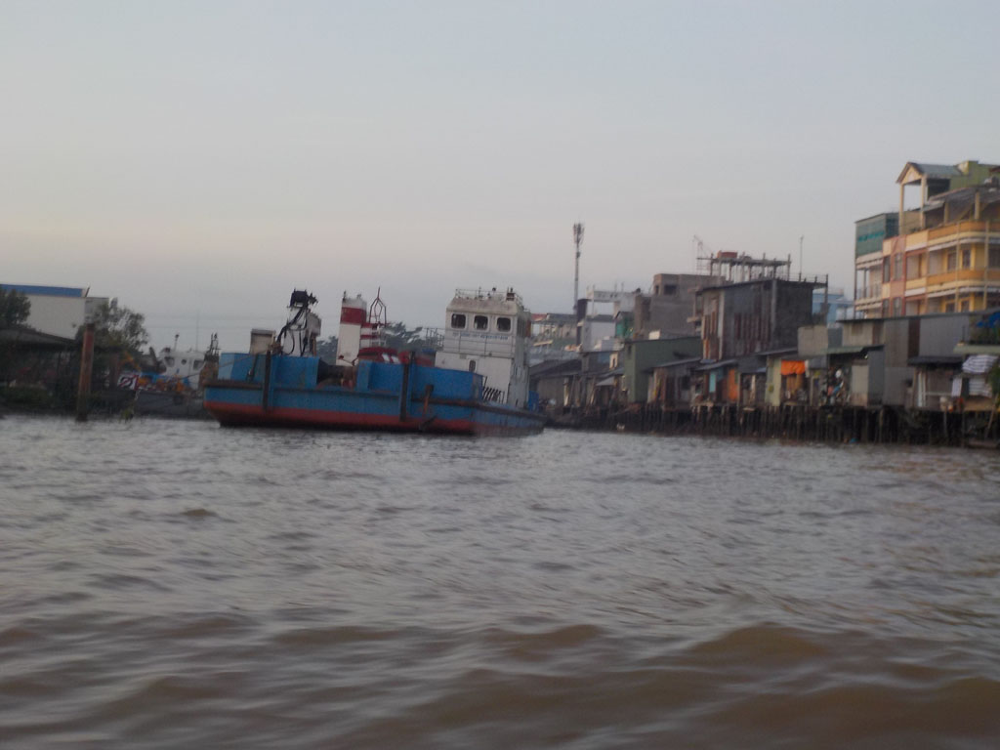
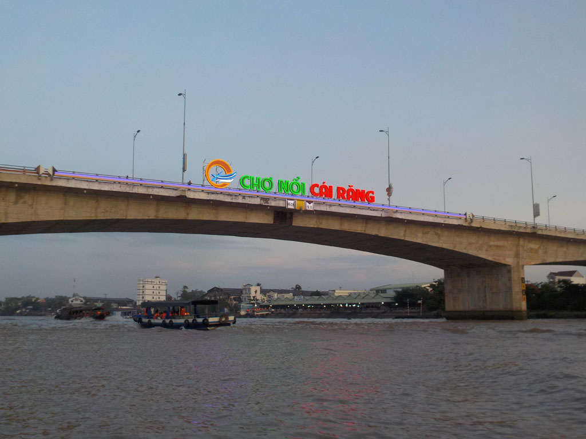
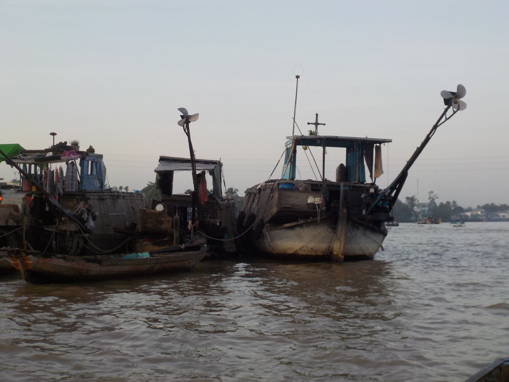
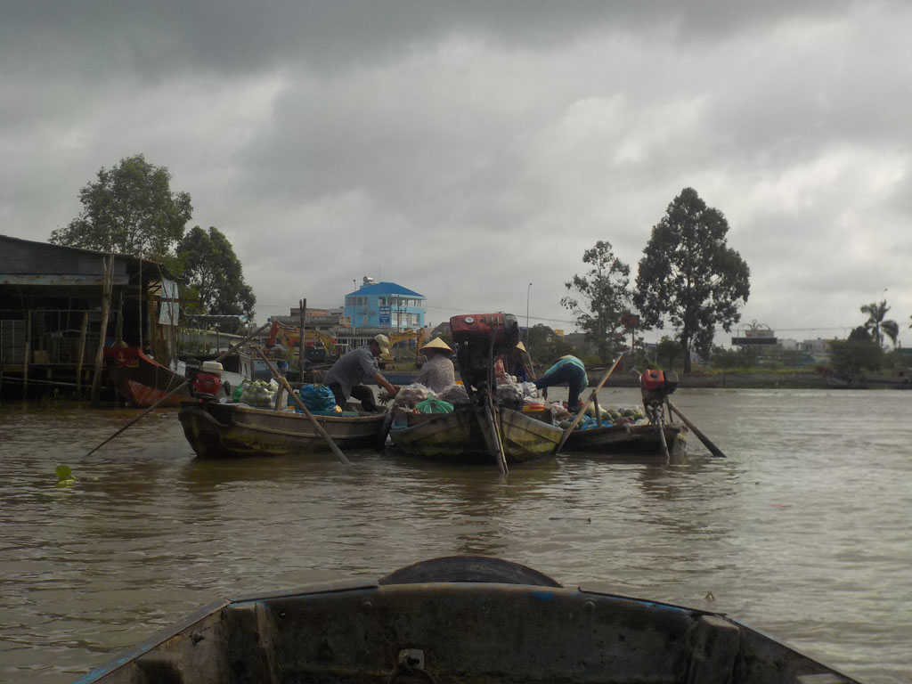
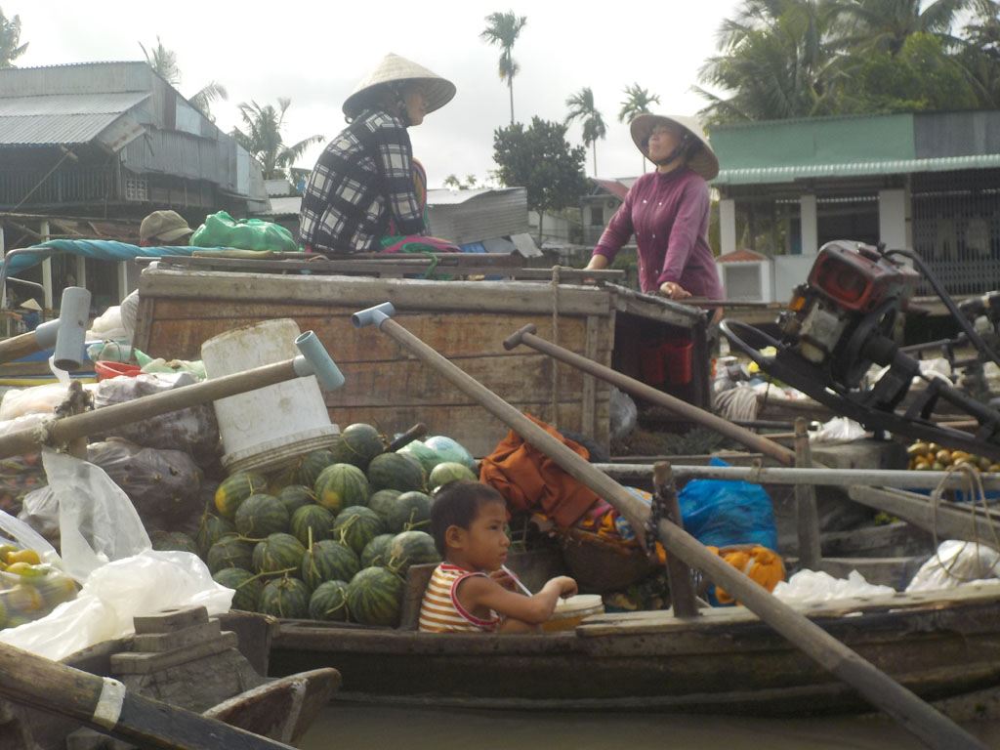
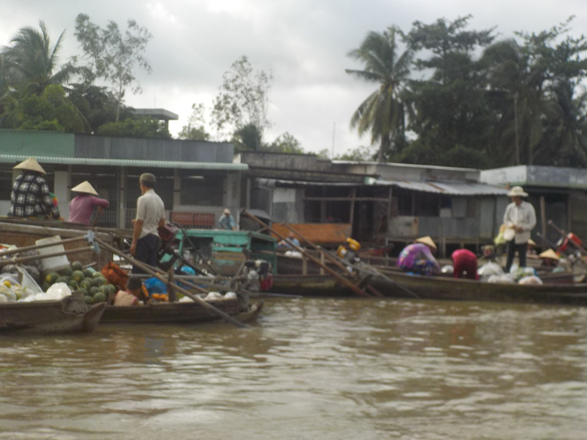
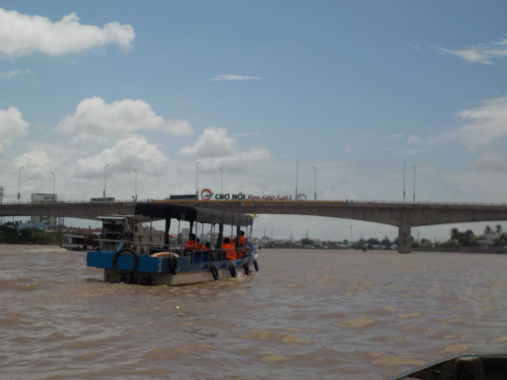

4h30 Réveil.

4h50 le batelier vient toquer à notre porte, il ne parle pas anglais (supplément 10$), pas grave nous nous comprendrons toute la journée.

5h00 Nous sommes sur l’eau, direction le **marché** flottant, le tour sera sublime. Par moment nous serons suivi par un autre bateau, celui de la femme du batelier. Elle tresse pour les enfants des animaux en feuille. On s’arrête dans une petite gargote au bord de l’eau pour manger phô, nems et bananes.

12h00 nous revenons juste au moment où l’averse tombe.

15h00 Après une pause bienvenue, on retourne prendre un café, jus de citron chez les basketteurs voisins, avant de revenir boucler les sacs pour le lendemain.

18h30 direction la statue d’oncle Ho pour essayer le restaurant voisin de celui de la veille. Nouilles sautées aux crevettes, riz cantonais, porc aux épices et riz. Bières et jus de citron.

21h00 bien fatigués tout le monde s’endort vite.