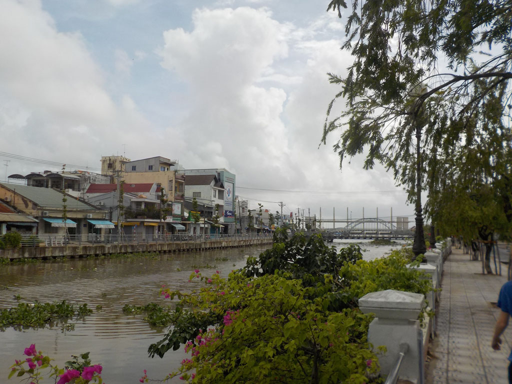

7h00 Réveil.

Taxi pour la gare routière. Minibus pour la ville voisine de **Rach Gia**. c’est une véritable promenade dans la campagne, avec une belle pause caphé où nous échangeons avec le chauffeur et les autres passagers, surpris de voir une famille sur ces chemins.

12h00 arrivés à la gare routière on prend un taxi pour rejoindre notre hôtel.

Nous retournons à pieds à la gare routière la plus proche prendre nos billets de bus pour le lendemain. Avant de revenir à l’hôtel se doucher et reposer pendant l’averse.

14h00 Il est temps d’explorer cette ville, bien agréable. Pause caphé pendant une seconde averse. Nous visitons le front de mer, des **temples**, le **musée**. Avant de se trouver une petite terrasse vers 1600 pour dessiner, tresser en buvant des caphés et des jus.

17h30 on retourne en ville, on découvre le phare et les rues alentour.

19h00 arrêt sous une tente au bord de la route pour manger un excellent repas. Riz porc grillé x 3, riz poulet mariné grillé.

On se prend ensuite un caphé des bières non loin de l’hôtel, en regardant l’agitation de la ville.