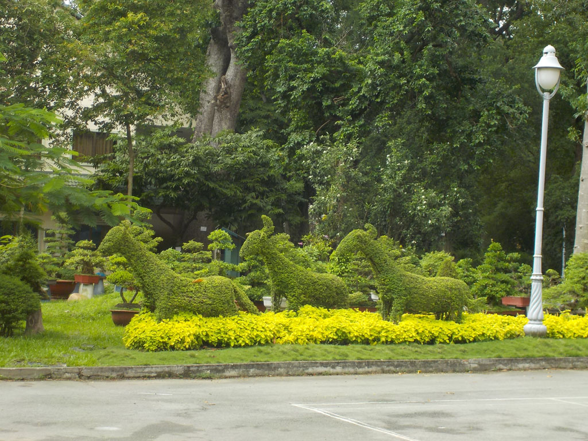

6h25 réveillés avant tout le monde je veux sortir de l’hôtel, mais le rideau de fer est baissé et il n’y a personne.

8h00 Sacs bouclés nous allons vite rejoindre notre petite maison. Nous posons nos sacs. Nous logeons au 1er et dernier étage de cette maison tenue par une veille dame et son mari.

8h20 on part en balade. On commence par un arrêt au **parc municipal** pour prendre un caphé avec les petits gâteaux que nous avons acheté en chemin. C’est le rendez vous des amoureux des oiseaux. Ils sont tous là avec leur cage. C’est un moment très sympa. Nous allons ensuite au parc botanique et visitons le **zoo**.

Pendant la grosse averse de 14h00 on s’arrête à la a cantine du zoo, escalope de porc, poulet grillé, oeufs sur plat riz, jus de canne et bières. Très simple et très bon.

Sur le retour on profite du **musée** de la ville ainsi que du **musée** d’art modernes.

16h20 On s’arrête chez Tony pour caphés et sodas avant de revenir vers 17h00 à notre guesthouse.

19h00 Déçus par l’expérience de la veille et comme nous ne voulons plus trop marcher aujourd’hui, on se rabat sur l’enseigne “monHué” une chaine de restauration local. Galettes vermicelle riz porc cacahuètes légumes, nouilles herbes porc cacahuètes, pat de riz gluant crevettes oignons. Très bon.

On revient en prenant un caphé sur le trottoir de la gargote la moins éclairée de la rue.

21h00 Dodo

0h00 La fanfare sonne jusqu’à 3h00, c’est la procession payée pour l’enterrement de la vieille femme morte 3 maisons plus loin.