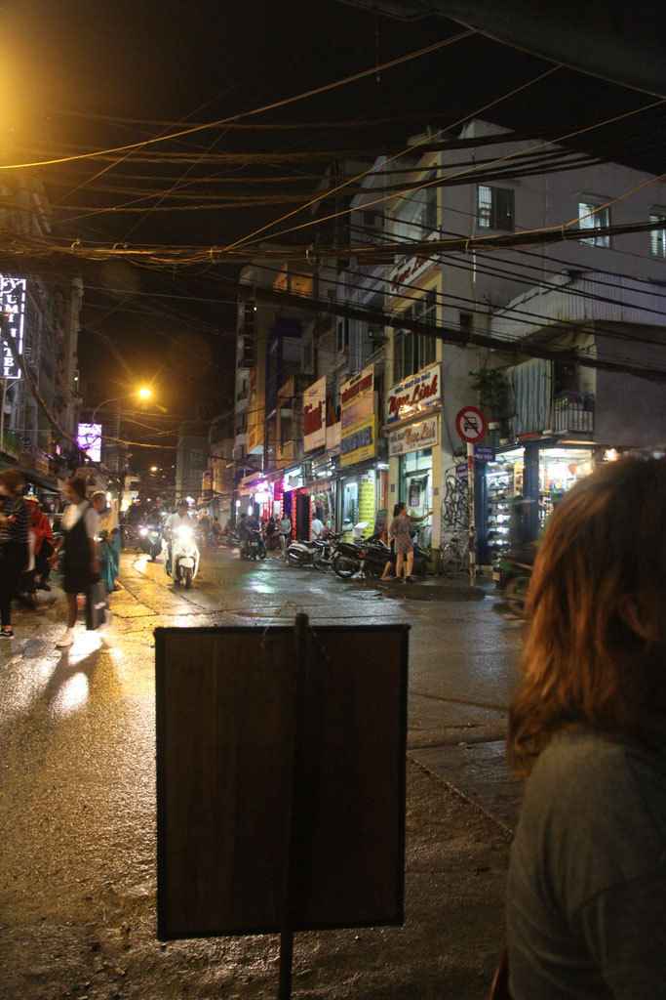

7h00 je vais chercher les croissants.

8h00 Encore une belle balade en perspective. Mais avant tout nous retournons prendre un caphé avec les oiseaux dans le parc municipal. Nous enchainons ensuite avec le **musée** de la guerre bondé et le **musée** de la femme désert.

12h00 Pause repas dans un petit boui-boui tenu par deux mamies, poulet, escalope porc, riz, bières, jus.

13h00 On repart vers la pagode repérée sur le plan quand soudain c’est le déluge. Tout le monde s’abrite comme il peut. Nous nous retrouvons sous un porche et au bout de 20min nous finissons par prendre un taxi pour retourner à la guesthouse.

14h00 Il pleut toujours.

15h00 la pluie se calme, on repart en balade à la recherche d’e la boutique tendance avec les objets fabriqués avec des éléments de propagande détournés. Trop chic, trop chers… Direction le palais de la réunification, on y arrive à 16h27 et cela ferme à 16h30…

Retour à la guesthouse en passant par le marché central. Nous achetons enfin nos cartes postales sur le retour.

19h00 repas à l’Asian Kitchen, côte de porc panée (bonne, j’ai gouté, mais E. sera malade toute la nuit), nems, porc sauce aigre douce, curry de crevettes très bon.

22h00 dodo

23h00 la fanfare recommence.

