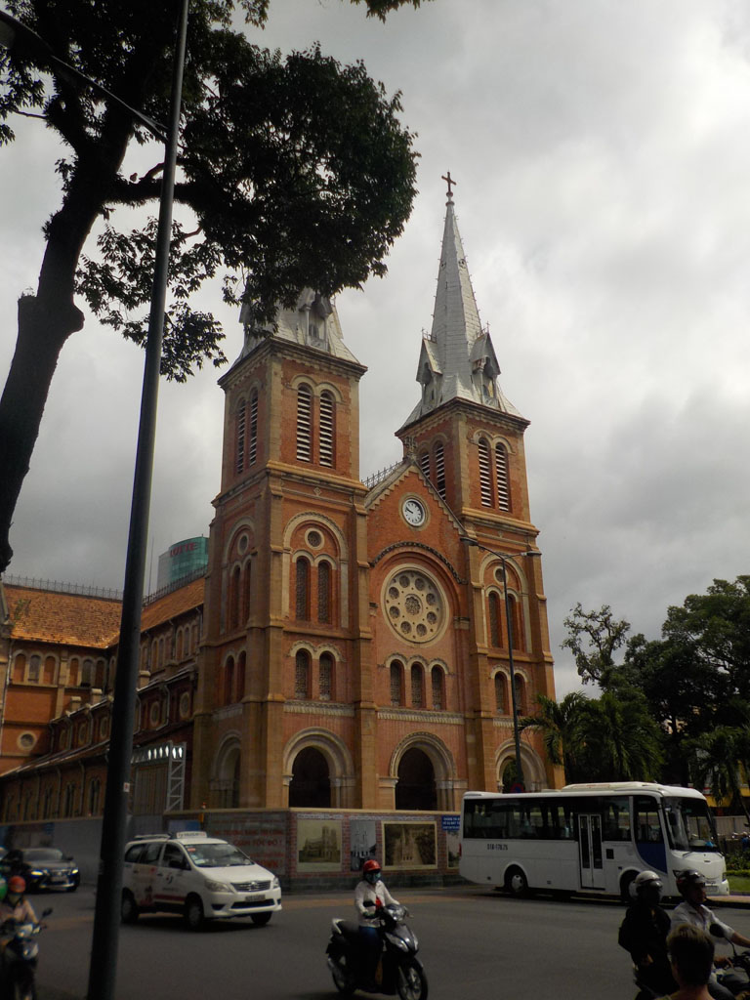

4h30 Réveil gastro E., il pleut à verse

7h00 je pars renouveler nos stocks de papier toilette mis à mal

7h30 pour se consoler viennoiseries pour tous.

11h30 E. va mieux, le ciel aussi, on en profite pour boucler les sacs.

Départ en taxi pour la poste, le compteur est trafiqué grosse arnaque, on s’en est rendu compte trop tard.

E. nous fait une petite rechute, pendant que les filles postent les cartes. On reprend un taxi cette fois ci pour la gare. Nous prenons une grande assiette de riz à la cantine de la gare pour caler tout ce petit monde.

14h00 nous montons dans le train, c’est parti pour 23h00 sur un siège en bois. Dommage que l’on soit séparé et qu’il faille faire la police pour qu’une grand mère veuille bien rendre le siège des enfants (elle s’est assise et à poussé sans vergogne les enfants contre la cloison).

