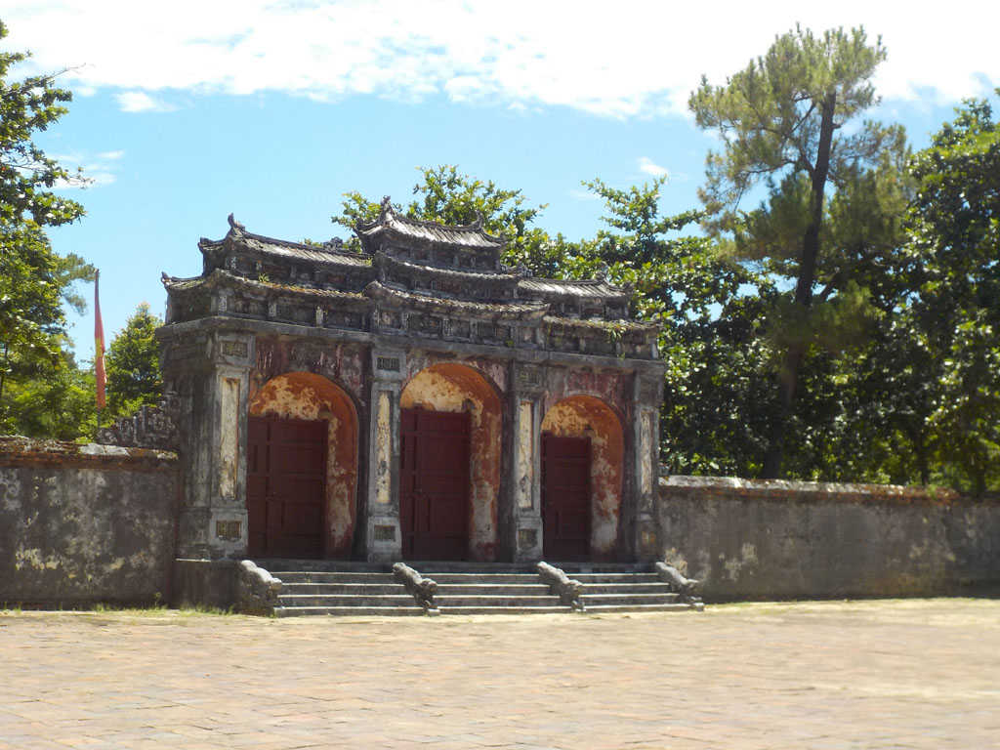
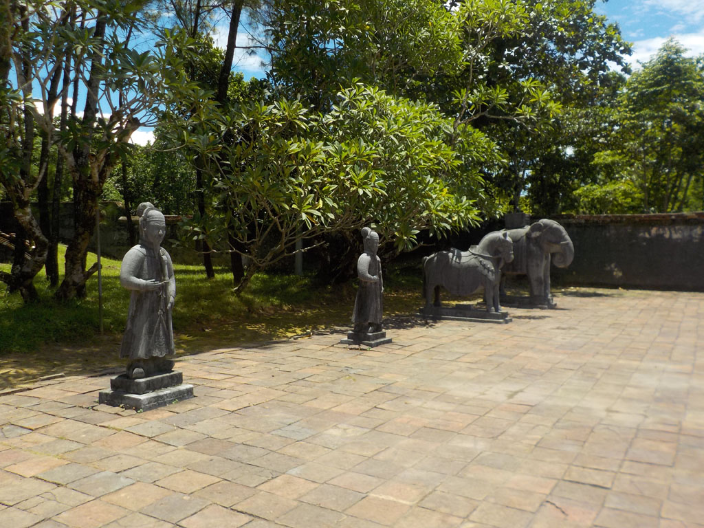
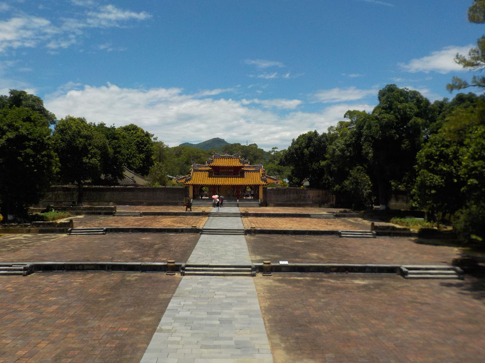
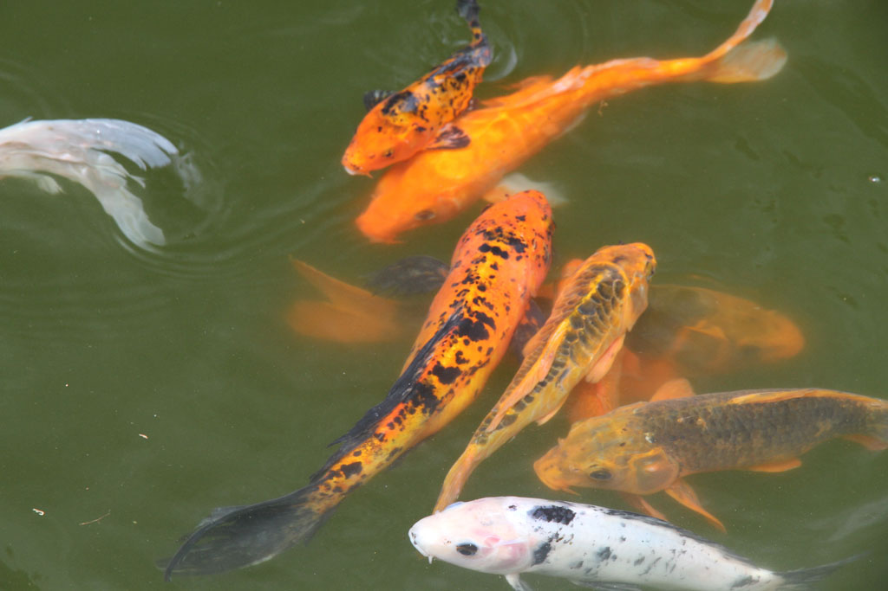
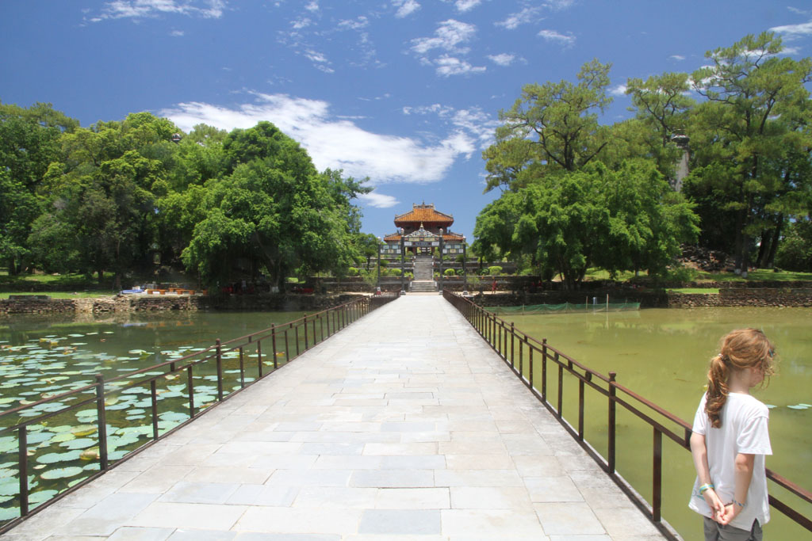
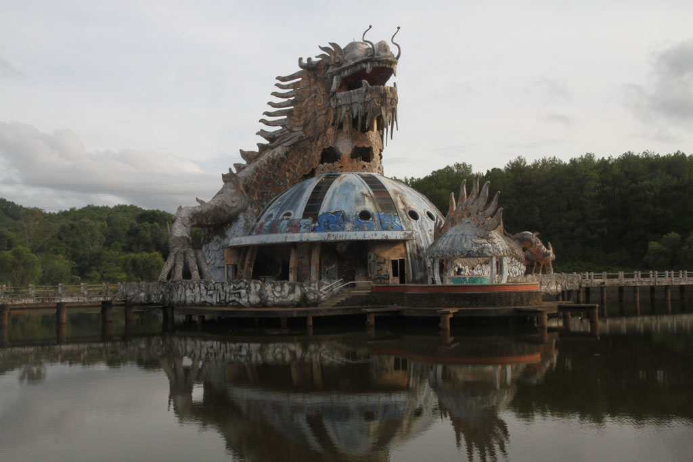
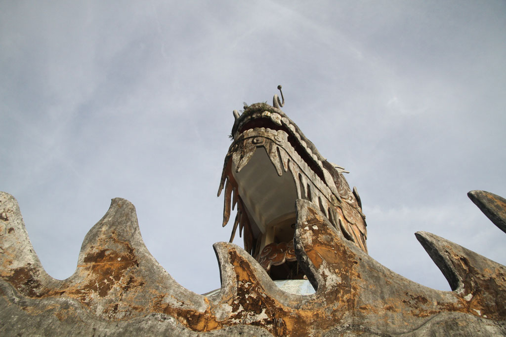
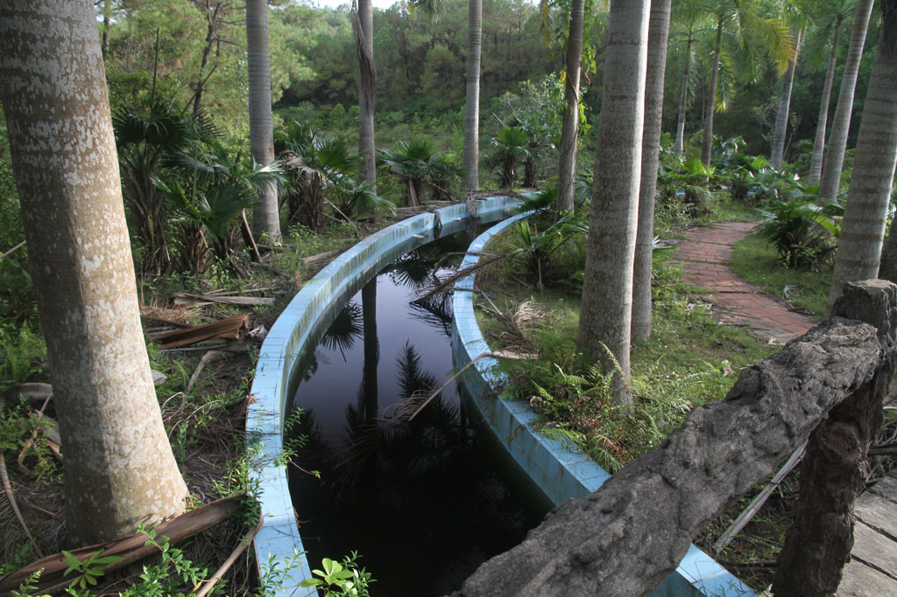
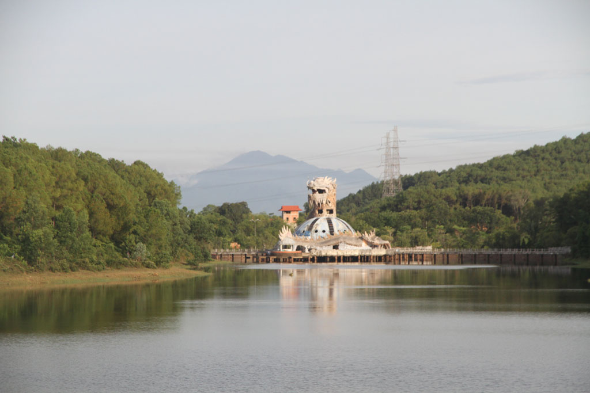

8h00 réveil et petit déjeuner à l’hôtel. Pancakes chocolat, oeufs, cafés, jus de citron.

Nous prenons un taxi pour la pagode de **Thien Mu**, après la visite nous prenons un jus de canne, sodas, caphé dans une gargote. Et au retour nous retrouvons le même taxi.

11h00 Direction le tombeau impérial de **Tu Duc**, du coup le taxi nous propose de nous attendre. Nous déclinons car nous ne voulons pas être pressés.

Au retour il est encore là :)

Nous nous faisons déposer dans la citadelle. Nous allons visiter le **musée historique** complément désert. Une ambiance particulière se dégage de ce lieu, les poules des gardiens picorent au milieu des véhicules militaires.

On retourne chez **Cathy** prendre jus et caphés et revenons ensuite par les ruelles.

16h10 les enfants et G. se reposent. Je prends un taxi pour le parc aquatique abandonné (**Hồ Thuỷ Tiên**). Je parcours le lieu un peu au pas de course car le taxi m’attend.

18h45 Retour chez le tailleur pour l’essayage, il y a quelques retouches à faire pour le lendemain.

19h30 **B-41**, crevettes BBQ, porc BBQ, riz œufs porc, bières et sodas. Nous essayons désespérément de faire venir les touristes qui restent concentrés sur leur guide. Seul un couple de français nous écoute. Ils seront ravis de la découverte.

22h00 caphé et jus au **Koré** sous les lampions face à la rivière.

dodo