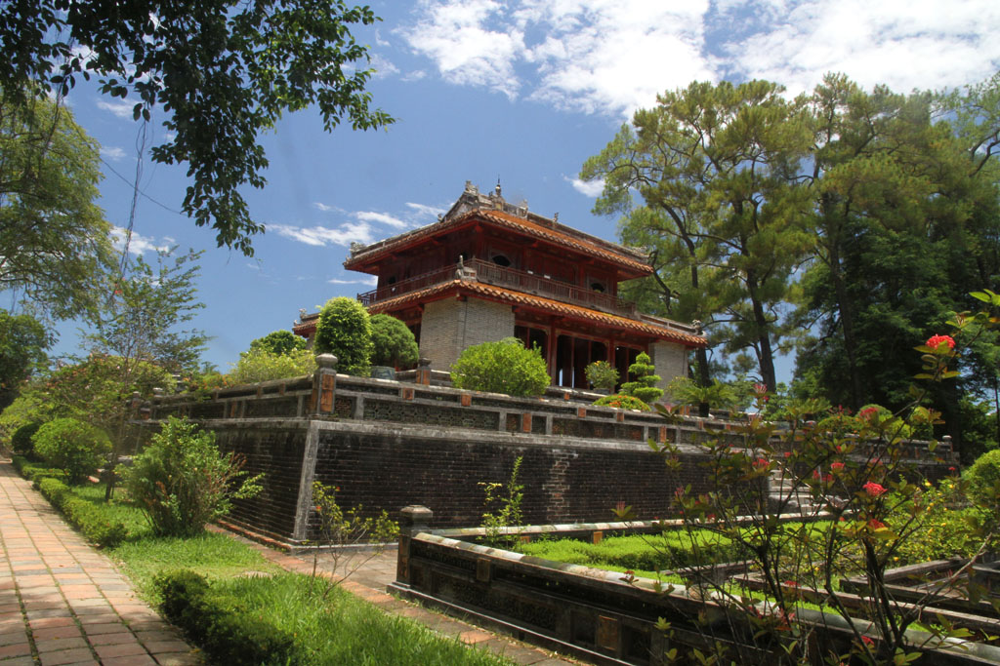

8h00 réveil et petit déjeuner à l’hôtel. Pancakes chocolat, oeufs, cafés, jus de citron.

9h00 les sacs sont bouclés, on galère pour réserver un hôtel à Hanoï, on se rabat sur booking.com

Nous retrouvons par hasard le taxi de la veille, aujourd’hui nous allons visiter la tombe impériale de **Minh Nang**, c’est une très belle visite. Nous sommes quasiment seuls sur le site.

13h00 De retour on s’arrête au **Kore**, profiter d’un dernier jus ou caphé face à la rivière.

14h00 On repart chercher les robe de ces 2 demoiselles.

15h00 Pause repas dans une cantine, ribs marinés grillés, cote de porc marinée grillée, riz légumes, bières et jus.

16h30 nous somme de retour à l’hôtel comme il nous avait été demandé. Nous prenons une douche à l’office.

17h45 un mini bus vient enfin nous chercher.

18h15 Départ du sleeping bus.

19h30 pause repas rapide pour les chauffeurs.