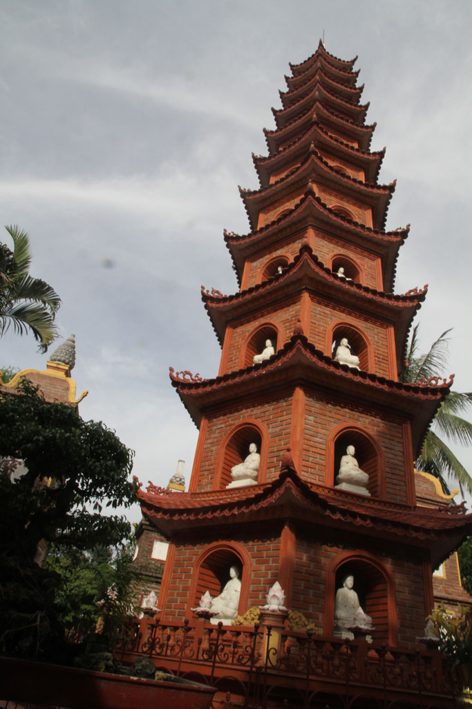
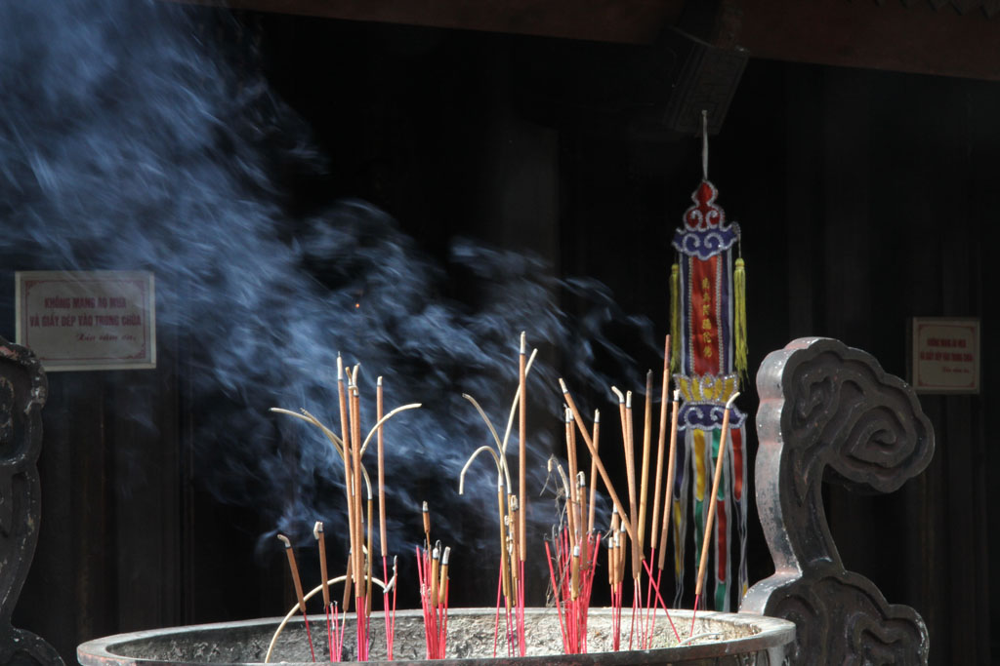

5h00 le bus nous dépose dans un coin d’**Hanoï**. Nous montons dans un taxi pour rejoindre le quartier de l’hôtel. Grosse arnaque, encore un compteur trafiqué, nous aurions du nous méfier du sac à dos placé de manière à cacher le compteur.

5h30 Évidement l’hôtel est fermé, nous trainons dans le quartier, en buvant quelques cafés dans les gargotes ouvertes.

7h30 l’hôtel ouvre mais il y a eu un problème avec les chambres et booking.com, du coup après discussion on se retrouve dans un dortoir de 8 pour seulement nous 4.

8h00 les sacs posés dans la chambre, on part en balade.

10h00 Pause café sur le trottoir avant de revenir tranquillement à l’hôtel, on rencontre le patron qui nous offre un régime de bananes.

12h00 on repart se promener dans une autre direction

13h00 arrêt dans un petit restaurant non loin du temple de la littérature, boeuf oignons ail riz, nouilles sautées au bœuf, crevettes pimentés légumes et riz, bières et jus.

14h00 un peu de géocaching, on découvre de beaux endroits dissimulées au premier regard, comme le **Huu Tiep Lake**

16h00 visite de la pagode **Trấn Quốc**

17h00 nous revenons en taxi.

19h00 nous recherchons désespérément un restaurant recommandée par le lonely planet, mais il est introuvable. Du coup on teste une cantine ouverte sur la rue. Nous aurions du nous méfier il y a trop de touristes et pas de locaux.Ce n’était pas bon, personne ne fini son plat.

20h30 Au supermarché, nous faisons les quelques emplettes cadeaux

21h00 bières / sodas dans la chambre