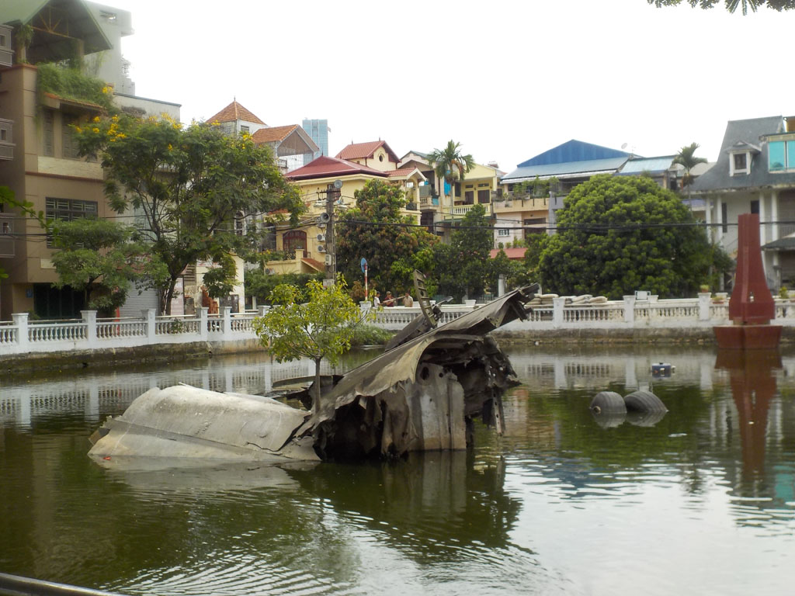
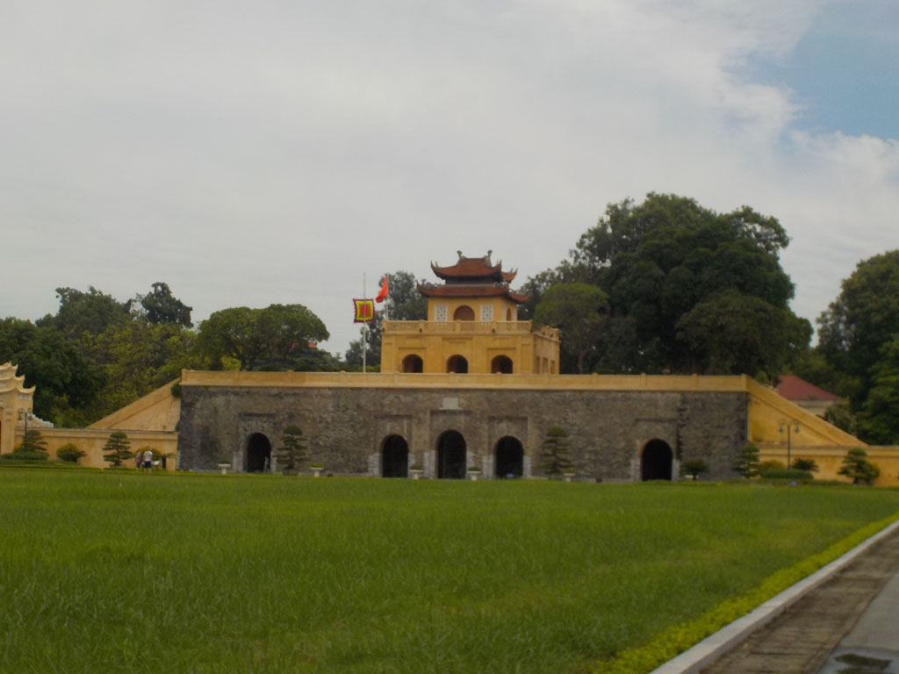
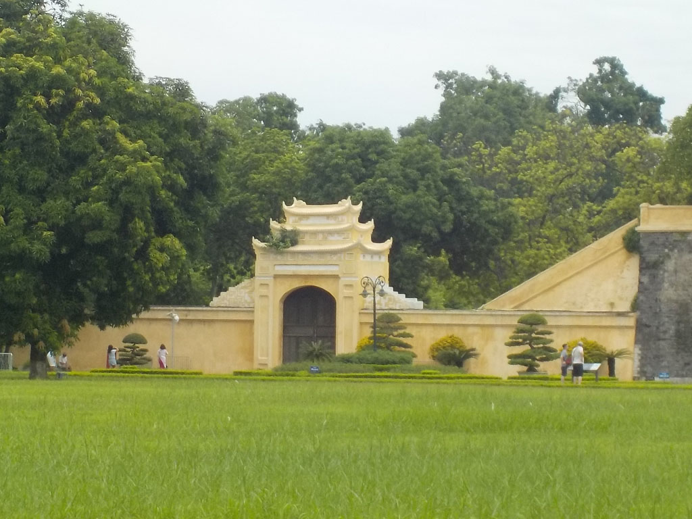
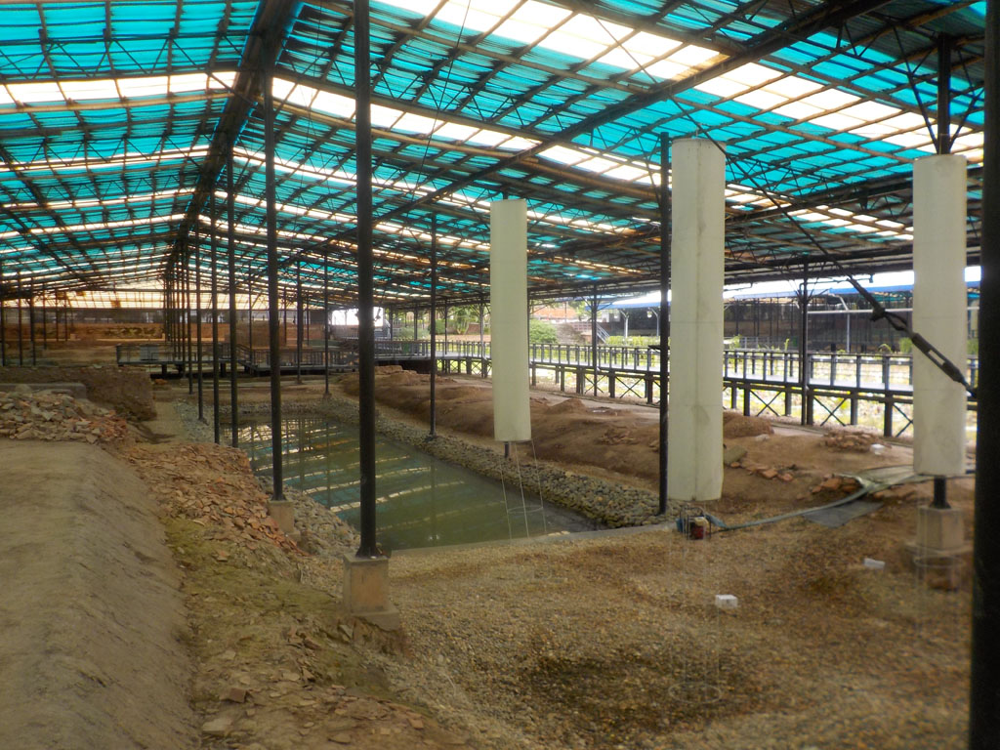
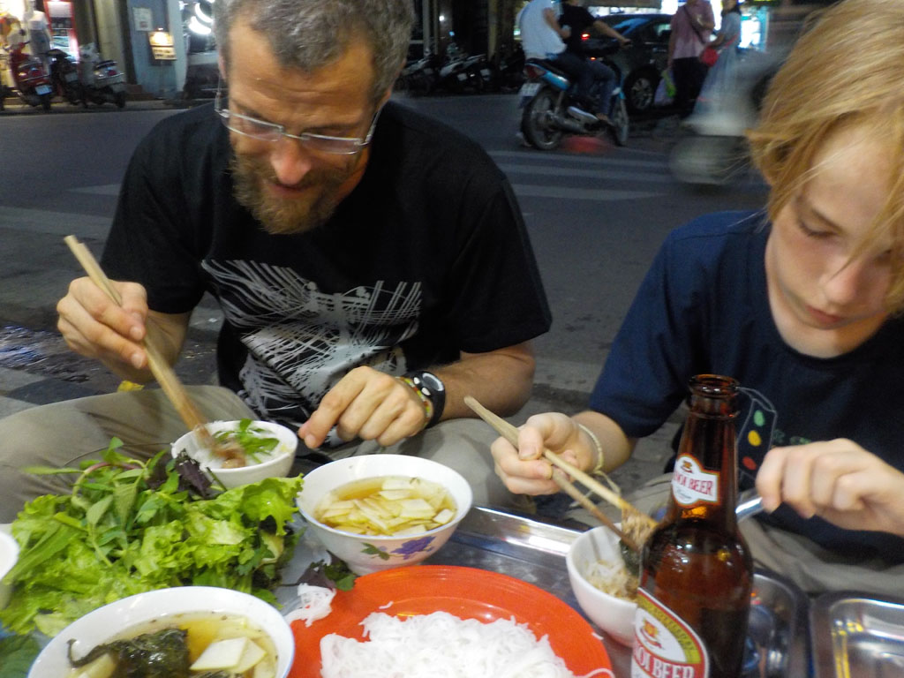
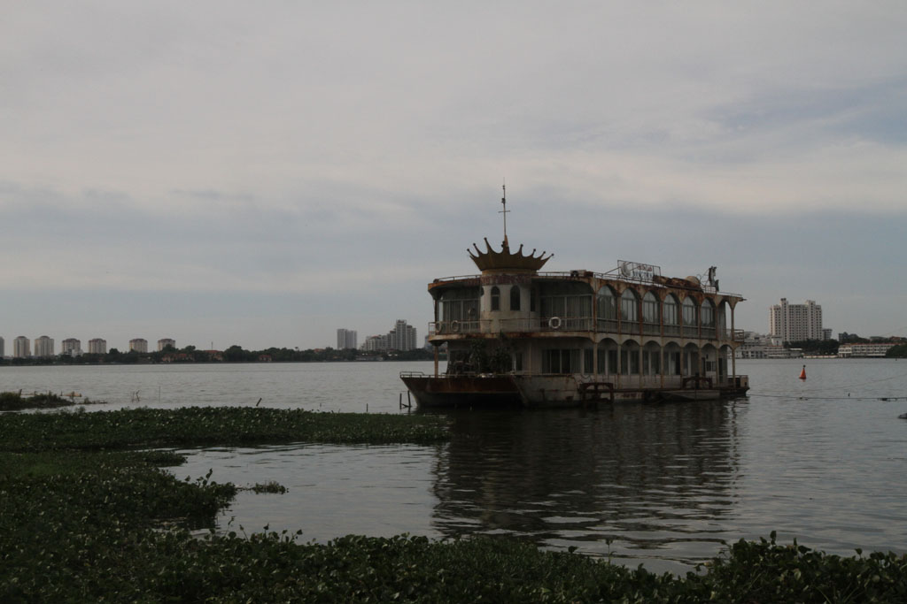
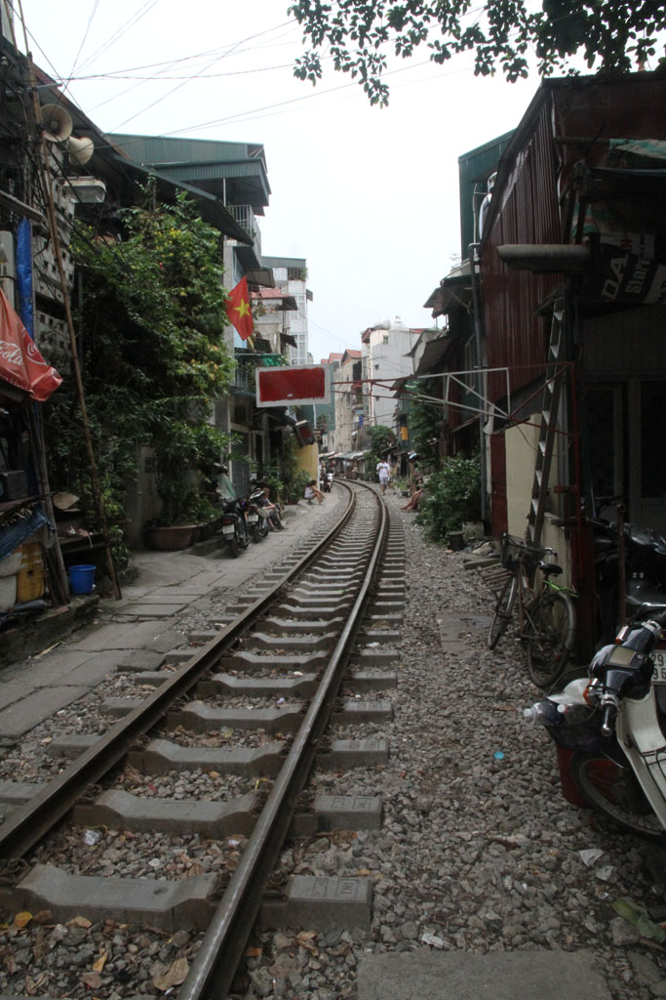
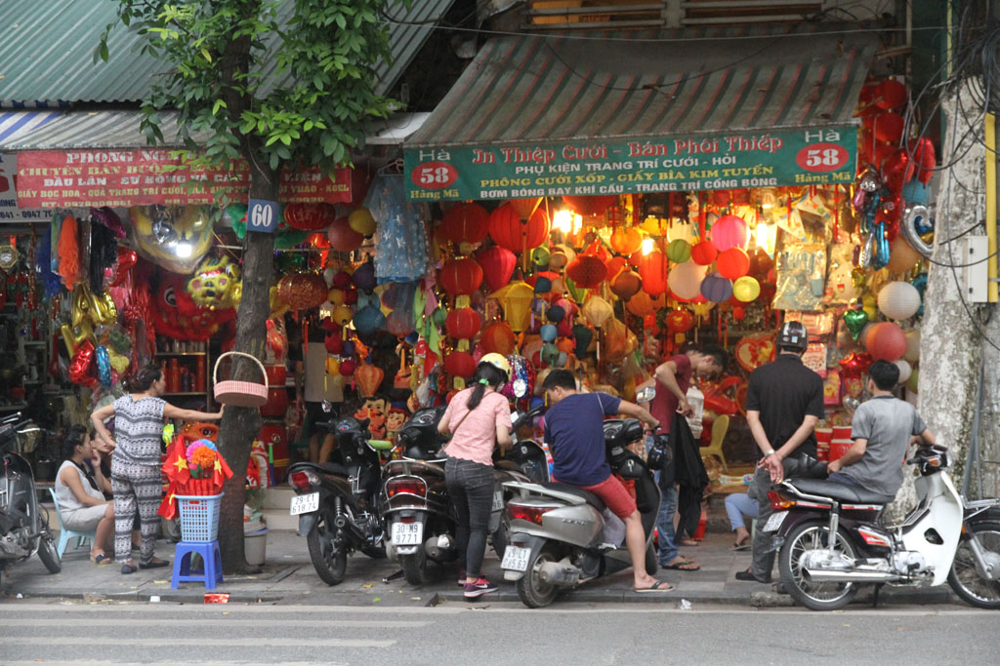

7h30 Réveil.

8h00 Petit déjeuner à l’hôtel, œufs, pain, café.

10h00 On retourne vers la citadelle, à pieds.

10h30 Pause caphé sur le trottoir en face.

11h00 Superbe visite de la **Cité impériale de Thang Long** dans la citadelle, il n’y a personne, surtout dans la partie archéologique de l’autre coté de la rue où nous serons totalement seuls.

14h00 Nous enchainons avec le **musée militaire**.

15h30 En direction du marché où nous faisons un petit tour, mais il n’y a que des vendeurs de chinoiseries.

17h00 Pause bières, jus

18h30 Nous reprenons nos bonnes habitudes et mangeons avec les habitants sur les petits tabourets bleues dans la rue, nouilles morceaux de porc, nems

19h30 Douche hôtel, sacs bouclés.

20h45 Le chauffeur/cousin/oncle du patron nous emmène à l’aéroport, il manque de s’endormir au volant plusieurs fois.

Fin du séjour